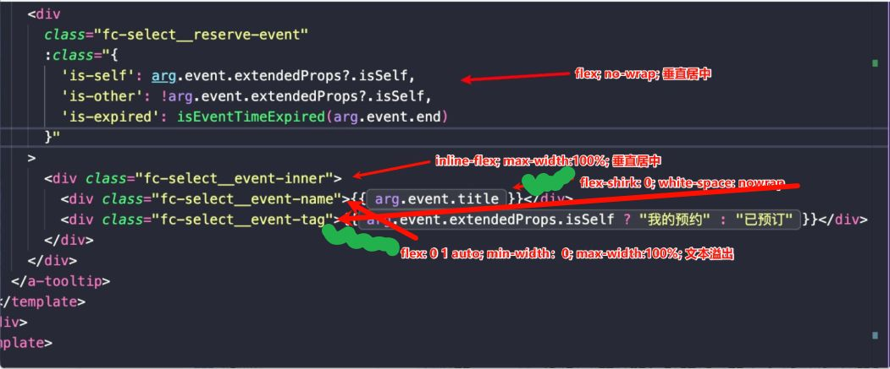

# 1、单行左侧可变展示省略号，右侧固定

我要实现左侧是可变，右侧是固定；如果 左侧 + 右侧 的内容溢出了这一整行，就将左侧的文本溢出处理

目前的 DOM 结构如下

实现的大致思路如下：
1、fc-select__reserve-event 垂直居中即可，并且设置 no-wrap 不做换行

2、fc-select__event-inner 
- 使用 inline-flex 让整体宽度随内容收缩又保持横向排列，而不是默认占满一整行
- 设置 max-width:100% 是为了让他的宽度不超过父容器

3、fc-select__event-tag 
- 设置 flex-shirk:0 主要是为了保证空间不足的情况下优先压缩 name，而不是 tag；
- white-space 保证文本不会换行，说白了就是默认展示

4、fc-select__event-name 
- 设置 flex: 0 1 auto，表示 flex-grow：0 不主动扩张去吃剩余的空间，flex-shrink：1 空间不够的时候允许缩小；flex-basis: auto：初始尺寸看 自身宽高/内容/width/height（更接近“按内容来”）
- min-width: 0 解除 flex 子项的默认最小内容宽度限制，允许它真正被压缩到触发省略；这个如何理解呢？
	- 这句话讲的是：**在 flex 容器里，子项默认“不会被压得比自己的内容更窄”**，所以你以为它会缩小并触发 `text-overflow: ellipsis`，但它硬撑着不缩，结果把布局顶爆/把别的元素挤没了。`min-width: 0` 就是把这个“硬撑的底线”取消掉，让它**真的允许变窄**，从而**宽度变窄 → 文本溢出 → 省略号生效**。
	- Flex 子项默认 `min-width: auto`，`min-width: auto` 的含义在 flex 场景下接近：**最小宽度 = min-content width（最小内容宽度），对文本来说，`min-content width` 往往就是：**一行里最长那段不可断的内容**（比如一串很长的英文/数字/URL，或 `white-space: nowrap`）所以即使你给了它 `flex: 1`、`overflow: hidden`，它也可能 **依旧不愿意被压缩**（因为 min-width 把下限卡住了）
	- `min-width: 0` 的作用就是：把最小宽度下限从“内容决定”改成 **0**，于是 flex 布局计算时就能把它压缩到更窄当实际宽度 < 文本需要的宽度时，`overflow: hidden + text-overflow: ellipsis + white-space: nowrap` 才会真正出现省略号
- max-width: 100% 则把上限卡在父容器内，避免超出可用宽度

在当前实现里，name+tag 作为一个整体居中：外层事件容器用 flex 居中且不换行，内层用 inline-flex 让整体宽度随内容收缩又保持横向排列、gap 与对齐生效；tag 设置不收缩、单行，name 允许收缩并加上 min-width (line 0)、overflow:hidden、text-overflow:ellipsis、white-space:nowrap。当空间不足时，Flex 先压缩可收缩的 name，触发省略号，而 tag 保持完整，从而实现 name 溢出省略、两者紧邻居中的效果。