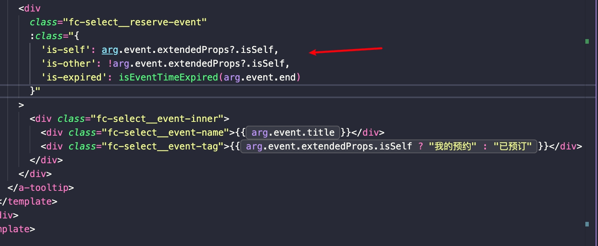

# 1、单行左侧可变展示省略号，右侧固定

我要实现左侧是可变，右侧是固定；如果 左侧 + 右侧 的内容溢出了这一整行，就将左侧的文本溢出处理

目前的 DOM 结构如下

实现的大致思路如下

在当前实现里，name+tag 作为一个整体居中：外层事件容器用 flex 居中且不换行，内层用 inline-flex 让整体宽度随内容收缩又保持横向排列、gap 与对齐生效；tag 设置不收缩、单行，name 允许收缩并加上 min-width (line 0)、overflow:hidden、text-overflow:ellipsis、white-space:nowrap。当空间不足时，Flex 先压缩可收缩的 name，触发省略号，而 tag 保持完整，从而实现 name 溢出省略、两者紧邻居中的效果。