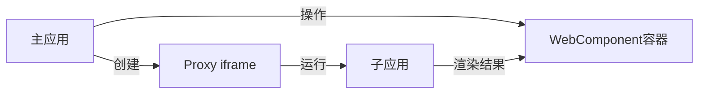
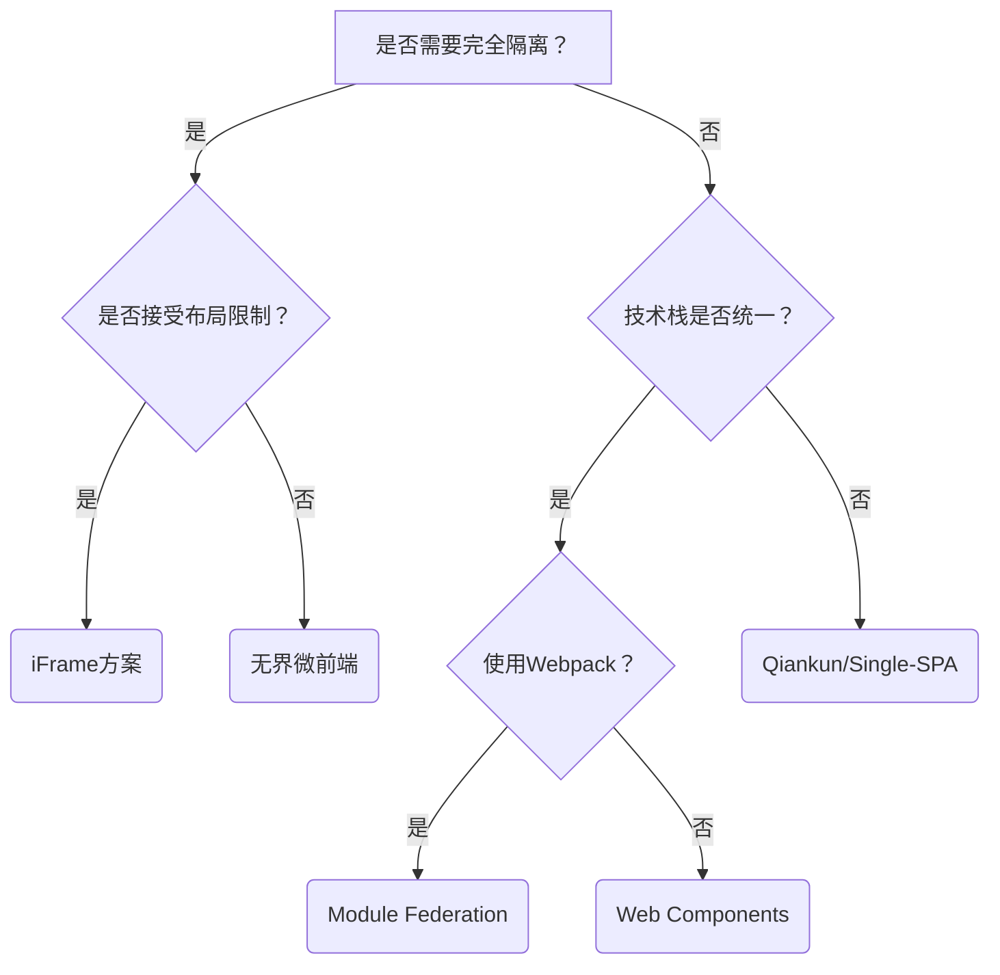

# 1 方案全景对比图
| **方案类型**       | **代表框架**          | **核心优势**                              | **主要缺陷**                              | **适用场景**                |
|--------------------|----------------------|------------------------------------------|------------------------------------------|----------------------------|
| **路由分发式**     | Nginx反向代理        | 零改造成本/部署简单                     | 页面刷新/状态丢失                        | 简单应用聚合               |
| **iFrame方案**     | 原生iframe           | 完全沙箱隔离/多技术栈支持               | 通信复杂/布局受限/SEO差                  | 第三方系统嵌入            |
| **Web Components** | LitElement/Stencil   | 浏览器原生支持/未来标准                 | 生态不成熟/调试困难                      | 渐进式现代化改造          |
| **JS沙箱式**       | Single-SPA/qiankun   | 应用级解耦/平滑过渡                     | 样式隔离成本高/资源重复                  | 大型复杂系统重构          |
| **模块联邦**       | Webpack 5 Module Federation | 资源共享/动态加载                   | Webpack强绑定/版本管理复杂               | Webpack技术栈体系         |
| **无界微前端**     | wujie                | 极致性能/原生隔离                      | 社区生态较小                             | 对性能要求高的金融场景    |

# 2 核心方案技术解析

## 2.1 路由分发式（最简单）

1、本质就是后端做nginx代理，然后通过路由分发来加载不同的资源
2、零前端改造成本，运维层面即可完成；但是每次切换导致整页刷新，无法保持应用状态

```nginx
# Nginx配置示例
location /app1 {
    proxy_pass http://app1-frontend/;
    proxy_set_header Host $host;
}

location /app2 {
    proxy_pass http://app2-frontend/;
}
```


## 2.2 iFrame方案（隔离性最强）

```html
<iframe 
  src="https://child-app.com"
  sandbox="allow-scripts allow-same-origin"
  style="width:100%; height:100%"
></iframe>
```

**通信方案**：

```javascript
// 父 → 子
document.getElementById('iframe').contentWindow.postMessage(data, '*');

// 子 → 父
window.parent.postMessage(data, '*');
```

**致命缺陷**：
- URL不同步：浏览器前进/后退失效
- 布局受限：弹窗无法突破iframe边界
- 性能损耗：每个子应用独立运行时

## 2.3 Web Components（未来标准）

```javascript
class MicroApp extends HTMLElement {
  connectedCallback() {
    this.attachShadow({ mode: 'open' });
    this.shadowRoot.innerHTML = `
      <div id="container"></div>
      <script src="https://child-app.js"></script>
    `;
  }
}
customElements.define('micro-app', MicroApp);
```

**浏览器支持度**：  
![[00 assets/67c7eb687869f45529ad2f792532c370_MD5.jpeg]]

**实践困境**：
- 样式隔离需手动实现（::part伪元素限制）
- 路由管理缺乏统一方案
- 旧版浏览器需polyfill（IE11完全不支持）


## 2.4 JS沙箱式（qiankun/Single-SPA）

**架构原理**：

```
主应用
├── 路由管理器
├── 沙箱系统（JS/CSS隔离）
└── 生命周期调度
    ↓ 动态加载
子应用（独立仓库）
```

**资源加载原理**：

```javascript
// 动态加载子应用
import(/* webpackIgnore: true */ 'https://cdn.com/app1.js')
  .then(app => app.mount())
```

**样式隔离方案对比**：

| **方案**             | 实现方式      | 优点    | 缺点       |
| ------------------ | --------- | ----- | -------- |
| Shadow DOM         | 浏览器原生隔离   | 完全隔离  | 组件库兼容性差  |
| CSS Scoped         | 添加属性选择器   | 实现简单  | 非真正隔离    |
| CSS Modules        | 编译时类名hash | 开发友好  | 需要构建工具支持 |
| Dynamic Stylesheet | 动态卸载样式表   | 运行时控制 | 闪屏问题     |

## 2.5 模块联邦（Module Federation - Webpack 5）

**革命性资源共享**：

```javascript
// app1/webpack.config.js (提供方)
new ModuleFederationPlugin({
  name: 'app1',
  filename: 'remoteEntry.js',
  exposes: {
    './Button': './src/components/Button',
  },
  shared: ['react', 'react-dom']
});

// app2/webpack.config.js (消费方)
new ModuleFederationPlugin({
  remotes: {
    app1: 'app1@http://cdn.com/remoteEntry.js'
  },
  shared: {
    react: { singleton: true },
    'react-dom': { singleton: true }
  }
});
```

**运行时动态加载**：

```jsx
const RemoteButton = React.lazy(() => import('app1/Button'));

function App() {
  return (
    <React.Suspense fallback="Loading">
      <RemoteButton />
    </React.Suspense>
  );
}
```

## 2.6 无界微前端（创新方案）

**突破性原理**：



**核心优势**：

- 利用iframe原生隔离能力
- 通过Proxy将DOM注入主文档
- 零感知通信：`window.parent`直接访问


# 3 选型决策树


