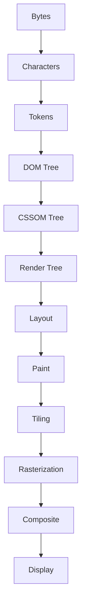

---
### 🤖 Assistant

以下是浏览器渲染 HTML 的完整过程详解，按关键阶段分步说明：

---

### **一、解析阶段（Parsing）**
1. **字节流解码**  
   - 浏览器接收 HTML 原始字节数据（如 UTF-8 编码）
   - 通过 `Content-Type` 判断字符编码，转换为字符流

2. **词法分析（Tokenization）**  
   ```html
   <!-- 示例代码 -->
   <div class="container">
     <p>Hello World</p>
   </div>
   ```
   - 分词器（Tokenizer）将字符流转换为 **Token 序列**：
     - `<div>` → StartTag Token
     - `class="container"` → Attribute Token
     - `</div>` → EndTag Token

3. **构建 DOM 树**  
   - 使用 **栈结构** 处理标签嵌套关系
   - 遇到 `<script>` 标签时：
     - 同步脚本：暂停解析，下载并执行脚本
     - `async/defer` 脚本：异步处理

---

### **二、样式计算（Style Calculation）**
1. **加载 CSS 资源**  
   - 遇到 `<link>` 或 `<style>` 标签时：
     - 同步加载外部 CSS（默认阻塞渲染）
     - 构建 **CSSOM 树**（CSS Object Model）

2. **标准化样式值**  
   ```css
   /* 原始声明 */
   div { font-size: 2em; }
   ```
   - 转换为绝对值：`font-size: 32px`（假设父级 16px）

3. **计算继承与层叠**  
   - 应用继承规则（如 `font-family` 向下传递）
   - 处理 `!important` 和选择器优先级

---

### **三、布局阶段（Layout/Reflow）**
1. **生成渲染树（Render Tree）**  
   - 合并 DOM + CSSOM，过滤：
     - 移除 `display: none` 元素
     - 保留可视节点（含伪元素如 `::before`）

2. **布局计算**  
   ```javascript
   // 布局过程伪代码
   function calculateLayout(node) {
     node.x = parent.x + marginLeft;
     node.y = previousSibling ? previousSibling.y + height : 0;
     node.width = availableWidth - padding * 2;
   }
   ```
   - 计算每个节点的几何信息：
     - 位置（x/y 坐标）
     - 尺寸（width/height）
     - 边距/填充（margin/padding）

3. **布局优化策略**  
   - **脏位标记**：仅重新计算变更部分
   - **批量更新**：避免频繁触发回流

---

### **四、绘制阶段（Painting）**
1. **生成绘制指令**  
   ```text
   // 示例绘制指令序列
   1. 填充矩形 (0,0 至 800x600，颜色#FFF)
   2. 绘制边框 (10,10 至 200x100，颜色#000)
   3. 渲染文本 "Hello" 在 (20,20)
   ```
   - 将渲染树转换为 **绘制记录（Paint Records）**

2. **图层管理**  
   - 根据 `will-change`、`z-index` 等属性分图层
   - 单独绘制需要合成的内容（如动画元素）

---

### **五、合成与显示（Composite & Display）**
1. **分块（Tiling）**  
   - 将图层拆分为 **16x16 像素** 的图块（Tile）
   - 优先处理可视区域（Viewport）内的图块

2. **光栅化（Rasterization）**  
   - 使用 GPU 加速将图块转换为位图
   - 存储到 **GPU 内存** 中

3. **合成显示**  
   ```javascript
   // 伪代码：合成器线程工作流程
   function frame() {
     const layers = [backgroundLayer, uiLayer, videoLayer];
     const frameBuffer = compositeLayers(layers);
     display(frameBuffer);
     requestAnimationFrame(frame);
   }
   ```
   - 合成器线程将各图层按正确顺序合并
   - 通过 **VSync 信号** 刷新屏幕显示

---

### **关键渲染路径优化策略**
| 阶段        | 优化手段                          | 效果                      |
|------------|----------------------------------|--------------------------|
| **解析**    | 异步加载脚本（`async/defer`）     | 减少 DOM 构建阻塞         |
| **样式**    | 避免深层嵌套选择器                | 降低 CSSOM 构建复杂度      |
| **布局**    | 使用 `flex` 替代 `float`          | 减少回流计算量            |
| **绘制**    | 限制重绘区域（`clip-path`）       | 减少无效绘制              |
| **合成**    | 启用 GPU 加速（`transform3d`）    | 跳过布局+绘制阶段          |

---

### **渲染过程可视化**


---

### **高级特性影响**
1. **虚拟滚动**  
   - 仅渲染可视区域 DOM 节点，减少布局/绘制计算量

2. **服务端渲染（SSR）**  
   - 提前生成初始 HTML，加速首屏渲染

3. **增量渲染（React Fiber）**  
   - 将渲染任务拆分为可中断的微任务

---

通过理解这些细节，开发者可以针对性地优化关键路径，实现更快的页面加载与交互响应。