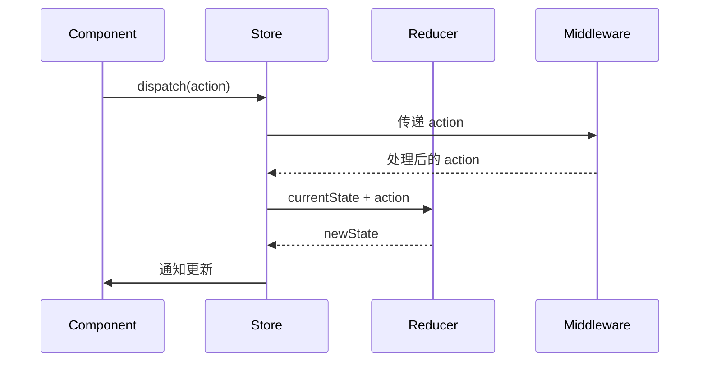

---
### 🤖 Assistant

Redux 的实现原理可以概括为 **"函数式状态容器"** 的设计思想，其核心机制围绕三个基本原则展开：

---

### 一、核心三原则实现原理
1. **单一数据源 (Single Source of Truth)**  
   ```javascript
   // 通过 createStore 创建的全局 store 实例
   const store = createStore(reducer, preloadedState, enhancer)
   ```

2. **状态只读 (State is Read-Only)**  
   ```javascript
   // 通过 Object.freeze 实现开发环境下的状态保护
   if (process.env.NODE_ENV !== 'production') {
     Object.freeze(currentState)
   }
   ```

3. **纯函数修改 (Changes via Pure Functions)**  
   ```javascript
   function reducer(state = initialState, action) {
     switch (action.type) {
       case 'INCREMENT':
         return { ...state, count: state.count + 1 } // 必须返回新对象
       default:
         return state
     }
   }
   ```

---

### 二、核心模块实现解析

#### 1. **Store 创建流程**
```javascript
function createStore(reducer, preloadedState, enhancer) {
  let currentReducer = reducer
  let currentState = preloadedState
  let currentListeners = []
  let nextListeners = currentListeners
  
  // 关键方法实现
  return {
    dispatch,
    subscribe,
    getState,
    replaceReducer
  }
}
```

#### 2. **dispatch 方法实现**
```javascript
function dispatch(action) {
  try {
    isDispatching = true
    // 执行 reducer 生成新状态
    currentState = currentReducer(currentState, action)
  } finally {
    isDispatching = false
  }
  
  // 通知所有监听器
  const listeners = (currentListeners = nextListeners)
  for (let i = 0; i < listeners.length; i++) {
    listeners[i]()
  }
  
  return action
}
```

---

### 三、关键技术实现细节

#### 1. **中间件机制实现**
```javascript
function applyMiddleware(...middlewares) {
  return (createStore) => (reducer, preloadedState) => {
    const store = createStore(reducer, preloadedState)
    let dispatch = () => {}
    
    const middlewareAPI = {
      getState: store.getState,
      dispatch: (action) => dispatch(action)
    }
    
    // 组合中间件链
    const chain = middlewares.map(middleware => middleware(middlewareAPI))
    dispatch = compose(...chain)(store.dispatch)
    
    return { ...store, dispatch }
  }
}
```

#### 2. **组合函数实现**
```javascript
function compose(...funcs) {
  return funcs.reduce((a, b) => (...args) => a(b(...args)))
}
```

---

### 四、数据流示意图


---

### 五、性能优化机制

#### 1. **浅层比较优化**
```javascript
// React-Redux 中的 selector 优化
function shallowEqual(objA, objB) {
  if (Object.is(objA, objB)) return true
  
  const keysA = Object.keys(objA)
  const keysB = Object.keys(objB)
  
  if (keysA.length !== keysB.length) return false
  
  for (let i = 0; i < keysA.length; i++) {
    if (!Object.prototype.hasOwnProperty.call(objB, keysA[i]) ||
        !Object.is(objA[keysA[i]], objB[keysA[i]])) {
      return false
    }
  }
  return true
}
```

#### 2. **不可变数据结构优化**
```javascript
// 使用 Immer 实现便捷的不可变操作
import produce from 'immer'

const reducer = produce((draft, action) => {
  switch (action.type) {
    case 'UPDATE_USER':
      draft.user.age = action.payload
      break
  }
})
```

---

### 六、与 Vuex/Pinia 的核心差异

| 特性               | Redux                 | Vuex/Pinia           |
|--------------------|-----------------------|----------------------|
| **响应式系统**     | 无内置响应式          | 深度集成 Vue 响应式  |
| **状态修改方式**   | 纯函数不可变更新      | 直接修改/可变操作    |
| **异步处理**       | 需中间件 (redux-thunk)| 原生支持 async/await |
| **类型系统**       | 需额外类型声明        | 原生 TS 支持 (Pinia) |
| **包体积**         | 2KB (核心) + 依赖     | 独立集成             |
| **开发工具**       | Redux DevTools 扩展   | Vue DevTools 集成    |

---

### 七、典型应用场景

1. **跨框架状态管理** (React/RN/Native)
2. **需要严格状态追溯的金融系统**
3. **复杂工作流应用**
4. **需要时间旅行调试的场景**
5. **微前端架构的全局状态共享**

---

### 八、核心源码解析

#### 1. **combineReducers 实现**
```javascript
function combineReducers(reducers) {
  return function combination(state = {}, action) {
    let hasChanged = false
    const nextState = {}
    
    Object.keys(reducers).forEach(key => {
      const reducer = reducers[key]
      const previousStateForKey = state[key]
      const nextStateForKey = reducer(previousStateForKey, action)
      
      nextState[key] = nextStateForKey
      hasChanged = hasChanged || nextStateForKey !== previousStateForKey
    })
    
    return hasChanged ? nextState : state
  }
}
```

#### 2. **订阅机制实现**
```javascript
function subscribe(listener) {
  nextListeners.push(listener)
  
  return function unsubscribe() {
    const index = nextListeners.indexOf(listener)
    nextListeners.splice(index, 1)
  }
}
```

---

### 九、设计哲学本质

Redux 的本质是 **将 Flux 架构与函数式编程结合** 的产物：  
1. **单向数据流**：确保可预测性  
2. **不可变性**：实现时间旅行调试  
3. **纯函数**：保证状态变更的可测试性  
4. **中间件机制**：扩展异步处理能力  

通过这种设计，Redux 在 2015 年解决了当时前端复杂应用的状态管理难题，其核心理念至今仍影响着现代状态管理库的设计。