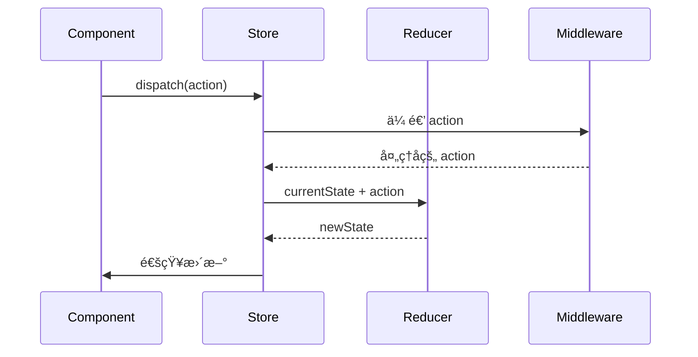

---
### 🤖 Assistant

Redux çš„å®ç°åŸç†å¯ä»¥æ¦‚括为 **"函数å¼çŠ¶æ€å®¹å™¨"** 的设计æ€æƒ³ï¼Œå…¶æ ¸å¿ƒæœºåˆ¶å›´ç»•ä¸‰ä¸ªåŸºæœ¬åŸåˆ™å±•å¼€ï¼š

---

### 一ã€æ ¸å¿ƒä¸‰åŸåˆ™å®ç°åŸç†
1. **å•ä¸€æ•°æ®æº (Single Source of Truth)**  
   ```javascript
   // 通过 createStore 创建的全局 store å®ä¾‹
   const store = createStore(reducer, preloadedState, enhancer)
   ```

2. **状æ€åªè¯» (State is Read-Only)**  
   ```javascript
   // 通过 Object.freeze å®ç°å¼€å‘ç¯å¢ƒä¸‹çš„状æ€ä¿æŠ¤
   if (process.env.NODE_ENV !== 'production') {
     Object.freeze(currentState)
   }
   ```

3. **纯函数修改 (Changes via Pure Functions)**  
   ```javascript
   function reducer(state = initialState, action) {
     switch (action.type) {
       case 'INCREMENT':
         return { ...state, count: state.count + 1 } // 必须返å›æ–°å¯¹è±¡
       default:
         return state
     }
   }
   ```

---

### 二ã€æ ¸å¿ƒæ¨¡å—å®ç°è§£æ

#### 1. **Store 创建æµç¨‹**
```javascript
function createStore(reducer, preloadedState, enhancer) {
  let currentReducer = reducer
  let currentState = preloadedState
  let currentListeners = []
  let nextListeners = currentListeners
  
  // 关键方法å®ç°
  return {
    dispatch,
    subscribe,
    getState,
    replaceReducer
  }
}
```

#### 2. **dispatch 方法å®ç°**
```javascript
function dispatch(action) {
  try {
    isDispatching = true
    // 执行 reducer 生æˆæ–°çŠ¶æ€
    currentState = currentReducer(currentState, action)
  } finally {
    isDispatching = false
  }
  
  // 通知所有监å¬å™¨
  const listeners = (currentListeners = nextListeners)
  for (let i = 0; i < listeners.length; i++) {
    listeners[i]()
  }
  
  return action
}
```

---

### 三ã€å…³é”®æŠ€æœ¯å®ç°ç»†èŠ‚

#### 1. **中间件机制å®ç°**
```javascript
function applyMiddleware(...middlewares) {
  return (createStore) => (reducer, preloadedState) => {
    const store = createStore(reducer, preloadedState)
    let dispatch = () => {}
    
    const middlewareAPI = {
      getState: store.getState,
      dispatch: (action) => dispatch(action)
    }
    
    // 组åˆä¸­é—´ä»¶é“¾
    const chain = middlewares.map(middleware => middleware(middlewareAPI))
    dispatch = compose(...chain)(store.dispatch)
    
    return { ...store, dispatch }
  }
}
```

#### 2. **组åˆå‡½æ•°å®ç°**
```javascript
function compose(...funcs) {
  return funcs.reduce((a, b) => (...args) => a(b(...args)))
}
```

---

### å››ã€æ•°æ®æµç¤ºæ„图


---

### 五ã€æ€§èƒ½ä¼˜åŒ–机制

#### 1. **浅层比较优化**
```javascript
// React-Redux 中的 selector 优化
function shallowEqual(objA, objB) {
  if (Object.is(objA, objB)) return true
  
  const keysA = Object.keys(objA)
  const keysB = Object.keys(objB)
  
  if (keysA.length !== keysB.length) return false
  
  for (let i = 0; i < keysA.length; i++) {
    if (!Object.prototype.hasOwnProperty.call(objB, keysA[i]) ||
        !Object.is(objA[keysA[i]], objB[keysA[i]])) {
      return false
    }
  }
  return true
}
```

#### 2. **ä¸å¯å˜æ•°æ®ç»“æ„优化**
```javascript
// 使用 Immer å®ç°ä¾¿æ·çš„ä¸å¯å˜æ“作
import produce from 'immer'

const reducer = produce((draft, action) => {
  switch (action.type) {
    case 'UPDATE_USER':
      draft.user.age = action.payload
      break
  }
})
```

---

### å…­ã€ä¸ Vuex/Pinia 的核心差异

| 特性               | Redux                 | Vuex/Pinia           |
|--------------------|-----------------------|----------------------|
| **å“应å¼ç³»ç»Ÿ**     | 无内置å“åº”å¼          | æ·±åº¦é›†æˆ Vue å“åº”å¼  |
| **状æ€ä¿®æ”¹æ–¹å¼**   | 纯函数ä¸å¯å˜æ›´æ–°      | ç›´æ¥ä¿®æ”¹/å¯å˜æ“作    |
| **异步处ç†**       | 需中间件 (redux-thunk)| åŸç”Ÿæ”¯æŒ async/await |
| **ç±»å‹ç³»ç»Ÿ**       | 需é¢å¤–ç±»å‹å£°æ˜        | åŸç”Ÿ TS æ”¯æŒ (Pinia) |
| **包体积**         | 2KB (核心) + ä¾èµ–     | ç‹¬ç«‹é›†æˆ             |
| **å¼€å‘工具**       | Redux DevTools 扩展   | Vue DevTools é›†æˆ    |

---

### 七ã€å…¸å‹åº”用场景

1. **跨框æ¶çŠ¶æ€ç®¡ç†** (React/RN/Native)
2. **需è¦ä¸¥æ ¼çŠ¶æ€è¿½æº¯çš„金è系统**
3. **å¤æ‚工作æµåº”用**
4. **需è¦æ—¶é—´æ—…行调试的场景**
5. **å¾®å‰ç«¯æ¶æ„的全局状æ€å…±äº«**

---

### å…«ã€æ ¸å¿ƒæºç è§£æ

#### 1. **combineReducers å®ç°**
```javascript
function combineReducers(reducers) {
  return function combination(state = {}, action) {
    let hasChanged = false
    const nextState = {}
    
    Object.keys(reducers).forEach(key => {
      const reducer = reducers[key]
      const previousStateForKey = state[key]
      const nextStateForKey = reducer(previousStateForKey, action)
      
      nextState[key] = nextStateForKey
      hasChanged = hasChanged || nextStateForKey !== previousStateForKey
    })
    
    return hasChanged ? nextState : state
  }
}
```

#### 2. **订阅机制å®ç°**
```javascript
function subscribe(listener) {
  nextListeners.push(listener)
  
  return function unsubscribe() {
    const index = nextListeners.indexOf(listener)
    nextListeners.splice(index, 1)
  }
}
```

---

### ä¹ã€è®¾è®¡å“²å­¦æœ¬è´¨

Redux 的本质是 **å°† Flux æ¶æ„ä¸å‡½æ•°å¼ç¼–程结åˆ** 的产物：  
1. **å•å‘æ•°æ®æµ**：确ä¿å¯é¢„测性  
2. **ä¸å¯å˜æ€§**：å®ç°æ—¶é—´æ—…行调试  
3. **纯函数**：ä¿è¯çŠ¶æ€å˜æ›´çš„å¯æµ‹è¯•æ€§  
4. **中间件机制**：扩展异步处ç†èƒ½åŠ›  

通过这ç§è®¾è®¡ï¼ŒRedux 在 2015 年解决了当时å‰ç«¯å¤æ‚应用的状æ€ç®¡ç†éš¾é¢˜ï¼Œå…¶æ ¸å¿ƒç†å¿µè‡³ä»Šä»å½±å“ç€ç°ä»£çŠ¶æ€ç®¡ç†åº“的设计。