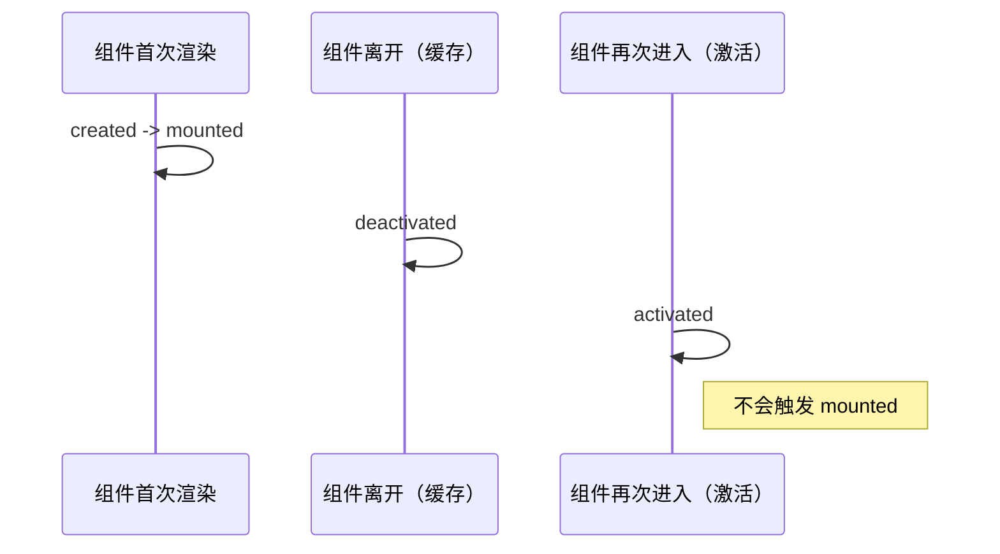

---
### 🤖 Assistant

Vue 的 `keep-alive` 是一个抽象组件（没有真实 DOM 节点），其核心原理是通过 **缓存组件实例** 来避免重复渲染，优化性能。以下是其核心实现原理：

---

### 一、**核心机制**
1. **缓存池（Cache）**：
   - 内部维护一个 `cache` 对象（类似 Map 结构），用于存储被缓存的组件实例
   - 缓存键（Key）生成规则：
     ```js
     key = vnode.componentOptions.Ctor.cid + (vnode.key ? `::${vnode.key}` : '')
     ```
     - `cid` 是组件构造函数 ID
     - `vnode.key` 是用户显式指定的 key

2. **虚拟 DOM 复用**：
   - 当组件切换时，直接从缓存中取出对应的 VNode 进行渲染
   - 避免了组件实例的重复创建和销毁

3. **生命周期管理**：
   - 被缓存的组件会触发 `deactivated` 钩子（进入缓存）
   - 重新激活时会触发 `activated` 钩子（从缓存恢复）
   - 不会触发常规的 `unmounted` 生命周期

---

### 二、**源码核心逻辑（简化版）**
```javascript
// 核心缓存结构
const cache = new Map()
const keys = new Set() // 用于实现 LRU 算法

export default {
  name: 'keep-alive',
  abstract: true, // 标记为抽象组件

  props: {
    include: [String, RegExp, Array], // 白名单
    exclude: [String, RegExp, Array], // 黑名单
    max: [Number, String] // 最大缓存数量
  },

  setup(props, { slots }) {
    // 返回 render 函数
    return () => {
      const rawVNode = slots.default()[0] // 获取子组件 VNode
      
      // 1. 条件过滤 --------------------------
      if (
        !rawVNode ||
        !isValidComponent(rawVNode) || 
        isExcluded(rawVNode, props)
      ) {
        return rawVNode // 直接返回原始 VNode
      }

      // 2. 缓存处理 --------------------------
      const key = generateKey(rawVNode)
      const cachedVNode = cache.get(key)

      if (cachedVNode) {
        // 命中缓存：更新 VNode 引用位置
        cachedVNode.componentInstance = rawVNode.componentInstance
        moveToFront(keys, key) // 更新 LRU 位置
      } else {
        // 未命中缓存：存入缓存
        cache.set(key, rawVNode)
        keys.add(key)
        // 执行缓存淘汰（LRU）
        if (props.max && keys.size > parseInt(props.max)) {
          pruneCacheEntry(cache, keys.values().next().value)
        }
      }

      // 3. 标记缓存 --------------------------
      rawVNode.keepAlive = true
      return rawVNode
    }
  }
}
```

---

### 三、**关键技术点**
1. **组件匹配规则**：
   - 通过 `include`/`exclude` 的匹配规则（检查组件 `name` 属性）
   - 实现逻辑：
     ```javascript
     function matches(pattern, name) {
       if (Array.isArray(pattern)) {
         return pattern.some(p => matches(p, name))
       } else if (typeof pattern === 'string') {
         return name === pattern
       } else if (isRegExp(pattern)) {
         return pattern.test(name)
       }
       return false
     }
     ```

2. **LRU 缓存淘汰策略**：
   - 当缓存数量超过 `max` 限制时，移除最久未被访问的缓存
   - 通过 `keys` 集合维护访问顺序

3. **状态保持原理**：
   - 缓存的是完整的组件实例（包括 DOM 状态、数据状态）
   - 通过 `vnode.elm` 保留真实 DOM 引用
   - 重新激活时直接插入缓存的 DOM 节点

---

### 四、**生命周期触发流程**


---

### 五、**使用注意事项**
1. **必须设置组件 `name`**：
   - 缓存匹配依赖组件名称
   - 匿名组件无法被正确缓存

2. **配合路由使用**：
   ```vue
   <router-view v-slot="{ Component }">
     <keep-alive>
       <component :is="Component" />
     </keep-alive>
   </router-view>
   ```

3. **避免内存泄漏**：
   - 及时清理不需要缓存的组件
   - 结合 `include` 控制缓存范围

---

### 六、**性能优化技巧**
1. **动态控制缓存**：
   ```javascript
   // 通过 $destroy() 强制清除缓存实例
   this.$vnode.parent.componentInstance.cache = {}
   ```

2. **结合 `key` 属性**：
   ```vue
   <keep-alive>
     <component :is="currentComponent" :key="dynamicKey" />
   </keep-alive>
   ```

3. **监控缓存状态**：
   ```javascript
   // 获取缓存实例数量
   const cacheSize = Object.keys(this.$refs.keepAlive._cache).length
   ```

---

通过这种设计，`keep-alive` 在保证功能的同时，将性能损耗降到最低。其核心思想是 **用内存换计算**，适用于需要保持组件状态（如表单内容、滚动位置）的频繁切换场景。