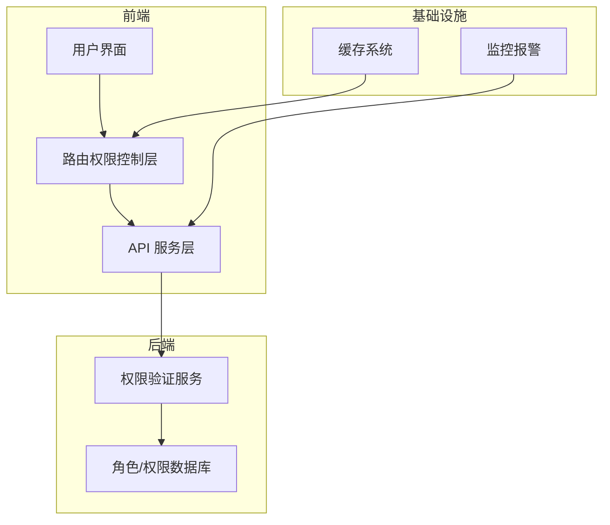
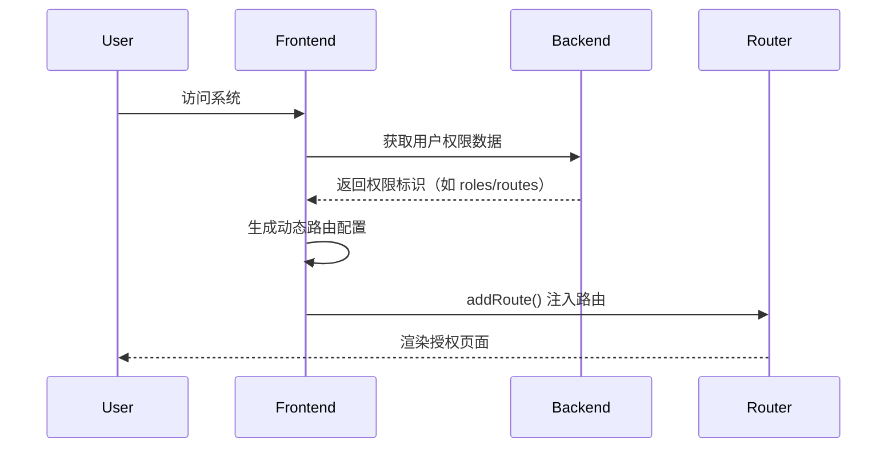
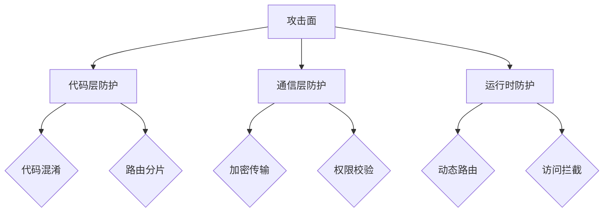

---
### 🤖 Assistant

以下是针对企业级前端路由权限管理系统的详细设计方案，涵盖 **核心架构、技术实现、安全策略** 等多个维度：

---

### 一、**系统架构设计**

#### 1. **分层架构模型**


---

### 二、**核心模块设计**

#### 1. **权限模型（RBAC 扩展）**
```javascript
// 数据结构示例
{
  users: [
    { id: 1, roles: ['admin'] }
  ],
  roles: [
    { 
      name: 'admin',
      permissions: ['user:delete', 'order:edit'],
      routes: ['/dashboard', '/user-manage']
    }
  ],
  menus: [
    { path: '/dashboard', meta: { requiredRole: 'admin' } }
  ]
}
```

#### 2. **动态路由处理流程**


---

### 三、**关键技术实现**

#### 1. **路由元信息（Route Meta）设计**
```javascript
// 路由配置示例
{
  path: '/financial',
  component: () => import('@/views/Finance.vue'),
  meta: {
    title: '财务中心',
    requiresAuth: true,
    permissions: ['finance:view'],
    breadcrumb: ['首页', '财务管理']
  }
}
```

#### 2. **路由守卫实现**
```javascript
router.beforeEach(async (to) => {
  // 1. 验证登录状态
  if (!isAuthenticated && to.meta.requiresAuth) {
    return '/login?redirect=' + encodeURIComponent(to.fullPath)
  }

  // 2. 已登录用户首次加载时获取权限
  if (isAuthenticated && !hasPermissionData) {
    const { roles, permissions } = await fetchUserPermissions()
    store.commit('SET_PERMISSIONS', { roles, permissions })
    
    // 3. 动态生成路由
    const dynamicRoutes = generateRoutes(permissions)
    dynamicRoutes.forEach(route => router.addRoute(route))
    
    return to.fullPath // 重试原始导航
  }

  // 4. 验证路由权限
  if (to.meta.permissions && !hasPermission(to.meta.permissions)) {
    return '/403'
  }
})
```

#### 3. **服务端返回路由规范**
```json
// 后端接口 /api/user/permissions 响应示例
{
  "code": 200,
  "data": {
    "routes": [
      {
        "path": "/dashboard",
        "component": "Dashboard", // 对应前端组件名
        "meta": {
          "title": "控制台",
          "icon": "el-icon-monitor"
        }
      }
    ],
    "buttons": ["user:create", "order:export"]
  }
}
```

---

### 四、**高级功能实现**

#### 1. **按钮级权限控制**
```vue
<template>
  <el-button 
    v-permission="'user:create'"
    @click="handleCreate"
  >
    新建用户
  </el-button>
</template>

// 自定义指令实现
Vue.directive('permission', {
  inserted(el, binding, vnode) {
    const { value } = binding
    const permissions = store.getters.permissions
    
    if (value && !permissions.includes(value)) {
      el.parentNode?.removeChild(el)
    }
  }
})
```

#### 2. **路由持久化方案**
```javascript
// 用户登录成功后
async function login() {
  const res = await authService.login(formData)
  
  // 1. 存储权限数据
  localStorage.setItem('ACCESS_TOKEN', res.token)
  localStorage.setItem('USER_ROUTES', JSON.stringify(res.routes))
  
  // 2. 动态加载路由
  loadDynamicRoutes(res.routes)
}

// 页面刷新时恢复
function initPermission() {
  const cachedRoutes = localStorage.getItem('USER_ROUTES')
  if (cachedRoutes) {
    loadDynamicRoutes(JSON.parse(cachedRoutes))
  }
}
```

#### 3. **灰度发布支持**
```javascript
// 根据用户角色加载不同版本路由
function generateRoutes(permissions) {
  if (isGrayUser(permissions.roles)) {
    return grayVersionRoutes // 灰度版本路由
  }
  return stableVersionRoutes
}
```

---

### 五、**安全增强策略**

#### 1. **双重校验机制**
```javascript
// 前端路由守卫
router.beforeEach((to) => {
  // 前端权限校验
  if (!hasRoutePermission(to)) return '/403'
})

// 后端接口中间件
app.use('/api/*', (req, res, next) => {
  // 后端二次校验
  if (!checkAPIPermission(req.user, req.path)) {
    return res.status(403).json({ error: 'Forbidden' })
  }
  next()
})
```

#### 2. **敏感路由混淆**
```javascript
// 动态生成路由路径
const secureRoutes = {
  path: `/report-${generateRandomHash()}`, // 每次部署生成不同路径
  component: () => import('@/views/SensitiveReport.vue')
}
```

---

### 六、**性能优化方案**

#### 1. **路由组件预加载**
```javascript
// 登录成功后预加载核心路由
function preloadCriticalRoutes() {
  const preloadList = ['Dashboard', 'UserList']
  preloadList.forEach(component => {
    import(/* webpackPrefetch: true */ `@/views/${component}.vue`)
  })
}
```

#### 2. **路由配置缓存**
```javascript
// 使用 indexedDB 缓存路由配置
const db = new Dexie('RouteCache')
db.version(1).stores({ routes: '++id, version, data' })

async function cacheRoutes(routes) {
  await db.routes.add({
    version: 'v2.1',
    data: routes,
    timestamp: Date.now()
  })
}
```

---

### 七、**监控与异常处理**

#### 1. **权限变更监听**
```javascript
// WebSocket 实时通知
const ws = new WebSocket('/permission-updates')
ws.onmessage = (event) => {
  const data = JSON.parse(event.data)
  if (data.type === 'PERMISSION_CHANGE') {
    localStorage.removeItem('USER_ROUTES')
    window.location.reload() // 强制刷新
  }
}
```

#### 2. **错误边界处理**
```javascript
// React 示例
class ErrorBoundary extends React.Component {
  componentDidCatch(error) {
    if (error.message.includes('Loading chunk')) {
      showChunkErrorModal()
    }
  }
}

// Vue 错误处理
Vue.config.errorHandler = (err) => {
  if (err.message.includes('Failed to fetch dynamically imported module')) {
    router.push('/chunk-error')
  }
}
```

---

### 八、**企业级最佳实践**

1. **路由配置中心化**：
   ```javascript
   // 统一管理路由配置
   export const baseRoutes = [...] // 基础路由
   export const dynamicRouteTemplates = [...] // 动态路由模板
   ```

2. **权限回收策略**：
   ```javascript
   // 定期检查权限有效性
   setInterval(async () => {
     const isValid = await checkPermissionValidity()
     if (!isValid) {
       logout()
     }
   }, 30 * 60 * 1000) // 每30分钟检查
   ```

3. **多租户支持**：
   ```javascript
   function generateTenantRoutes(tenantId) {
     return dynamicRoutes.map(route => ({
       ...route,
       path: `/${tenantId}${route.path}`
     }))
   }
   ```

---

### 总结：企业级路由权限系统的关键特性

| 特性               | 实现方案                          |
|--------------------|---------------------------------|
| **动态路由**        | `addRoute` + 权限验证            |
| **细粒度控制**      | 路由元信息 + 自定义指令            |
| **安全加固**        | 双重校验 + 路径混淆               |
| **高性能**          | 预加载 + 缓存策略                |
| **可维护性**        | 配置中心化 + 类型约束（TypeScript）|
| **可扩展性**        | 模块化设计 + 多租户支持           |

通过这种设计，企业级前端路由权限系统可以做到：
- **动态适配**：灵活响应组织架构和权限策略的变化
- **安全可靠**：多层次防御体系防止越权访问
- **性能卓越**：优化加载速度和资源利用率
- **易于维护**：清晰的代码结构和监控体系

实际落地时需要根据具体技术栈（Vue/React/Angular）调整实现细节，但核心设计理念可跨框架复用。


---
### 🤖 Assistant

---

针对前端全局路由表可能被逆向获取的安全隐患，以下是专业解决方案：

---

### 一、**防御策略分层架构**


---

### 二、**核心解决方案**

#### 1. **服务端动态路由下发（关键方案）**
```javascript
// 前端完全不再维护路由表
async function initRouter() {
  // 从服务端获取加密路由配置
  const { encryptedData } = await fetch('/api/getRoutes')
  const routes = decrypt(encryptedData, secretKey)
  
  // 动态创建路由实例
  const router = createRouter({
    history: createWebHistory(),
    routes: processRoutes(routes) // 动态转换路由配置
  })
}

// 服务端接口响应示例
{
  "code": 200,
  "data": {
    "routes": [
      {
        "path": "/7x9a2k", // 混淆后的路径
        "component": "a1b2c3d4", // 组件映射码
        "meta": { /*...*/ }
      }
    ],
    "mapping": {
      "a1b2c3d4": "Dashboard" // 仅前端维护的映射关系
    }
  }
}
```

#### 2. **组件动态注册技术**
```javascript
// 路由转换时动态解析组件
function processRoutes(serverRoutes) {
  return serverRoutes.map(route => ({
    path: route.path,
    component: () => dynamicComponentLoader(route.componentCode),
    meta: route.meta
  }))
}

// 动态组件加载器（无明确路径信息）
const componentMap = {
  'a1b2c3d4': () => import('@/views/Dashboard.vue'),
  'e5f6g7h8': () => import('@/views/UserManage.vue')
}

function dynamicComponentLoader(code) {
  if (!componentMap[code]) return import('@/views/404.vue')
  return componentMap[code]()
}
```

---

### 三、**增强防护措施**

#### 1. **路由路径混淆方案**
```javascript
// 服务端下发混淆路径
function generateObfuscatedPath(originalPath) {
  const hash = crypto.createHash('sha256')
                     .update(originalPath + Date.now())
                     .digest('hex')
  return `/${hash.substring(0,8)}/${originalPath}`
}

// 实际路由示例：
// 原始路径 /financial → 混淆路径 /7d3a8b21/financial
```

#### 2. **动态路由回收机制**
```javascript
// 定期变更有效路由
setInterval(async () => {
  const newRoutes = await refreshRoutes()
  router.removeRoute('previous-route-name')
  router.addRoute(newRoutes)
}, 3600 * 1000) // 每小时更新路由
```

---

### 四、**安全通信层设计**

#### 1. **路由配置加密传输**
```javascript
// 服务端响应加密示例（AES-GCM）
app.get('/api/routes', (req, res) => {
  const rawData = generateRoutes(req.user)
  const encrypted = crypto.encrypt(JSON.stringify(rawData), secretKey)
  res.send({ encryptedData: encrypted })
})

// 前端解密处理
async function loadRoutes() {
  const res = await fetch('/api/routes')
  const decoder = new TextDecoder()
  const decrypted = await crypto.subtle.decrypt(
    { name: 'AES-GCM' },
    secretKey,
    base64ToArrayBuffer(res.encryptedData)
  )
  return JSON.parse(decoder.decode(decrypted))
}
```

#### 2. **请求签名验证**
```javascript
// 前端添加路由请求签名
async function requestRoutes() {
  const timestamp = Date.now()
  const sign = crypto.createSign('sha256')
                     .update(`${userId}${timestamp}${secretKey}`)
                     .digest('hex')

  return axios.get('/api/routes', {
    headers: {
      'X-Signature': sign,
      'X-Timestamp': timestamp
    }
  })
}
```

---

### 五、**运行时防御机制**

#### 1. **路由访问监控**
```javascript
// 异常路径访问拦截
router.beforeEach((to) => {
  if (!isValidPath(to.path)) {
    reportSecurityIncident(`非法路径访问: ${to.path}`)
    return '/security-alert'
  }
})

// 路径有效性校验
const validPathPattern = /^\/[a-f0-9]{8}\/[\w-]+$/ // 匹配混淆路径格式
function isValidPath(path) {
  return validPathPattern.test(path)
}
```

#### 2. **内存数据防护**
```javascript
// 使用 Proxy 保护路由实例
const secureRouter = new Proxy(router, {
  get(target, prop) {
    if (prop === 'options') {
      throw new Error('禁止访问路由配置')
    }
    return target[prop]
  }
})

// 使用后无法通过 router.options.routes 获取完整路由表
```

---

### 六、**代码层防护方案**

#### 1. **高级代码混淆**
```javascript
// 使用专业混淆工具（如 Jscrambler）
module.exports = {
  build: {
    // 在构建流程中集成混淆
    plugins: [
      new JscramblerWebpack({
        keys: {
          accessKey: 'YOUR_KEY',
          secretKey: 'YOUR_SECRET'
        },
        params: [
          {
            name: 'objectPropertiesSparsing'
          },
          {
            name: 'stringSplitting'
          }
        ]
      })
    ]
  }
}
```

#### 2. **WebAssembly 敏感逻辑**
```rust
// 使用 Rust 编写路由验证逻辑（编译为 WASM）
#[wasm_bindgen]
pub fn validate_route(path: &str) -> bool {
    let valid_routes = ["7d3a8b21", "e5f6g7h8"];
    valid_routes.iter().any(|&r| path.contains(r))
}
```

---

### 七、**综合防护效果评估**

| 攻击方式               | 防御措施                     | 突破难度 |
|-----------------------|----------------------------|--------|
| 直接查看源码           | 代码混淆 + WASM            | ★★★★★  |
| 网络抓包获取路由配置    | 加密传输 + 动态签名         | ★★★★☆  |
| 逆向工程分析           | 内存保护 + 动态组件加载      | ★★★★☆  |
| 暴力路径探测           | 路径混淆 + 实时监控         | ★★★☆☆  |

---

### 八、**企业级实施方案**

1. **渐进式路由加载**：
   ```javascript
   // 分阶段加载不同安全等级路由
   async function loadSecureRoutes() {
     // 第一阶段：加载基础路由
     loadBasicRoutes()
     
     // 第二阶段：用户认证后加载核心路由
     await loadCoreRoutes()
     
     // 第三阶段：权限校验后加载敏感路由
     await loadSensitiveRoutes()
   }
   ```

2. **安全审计工具集成**：
   ```bash
   # 使用自动化安全扫描
   npm run security-scan --route-protection
   ```

3. **应急响应方案**：
   ```javascript
   // 检测到异常时立即重置路由
   securityMonitor.on('route-leak', () => {
     router.removeRoute('*')
     localStorage.clear()
     window.location.reload()
   })
   ```

---

### 总结：多层防御体系优势

1. **深度隐蔽**：通过服务端动态下发、路径混淆、代码加密等多重手段，确保攻击者无法获取有效路由信息  
2. **动态变化**：路由配置定期更新机制大幅增加攻击成本  
3. **纵深防御**：即便某层防护被突破，仍有后续安全机制进行拦截  
4. **合规性保障**：满足等保2.0、GDPR等法规对敏感信息保护的要求  

实施建议：
- 核心系统采用 **服务端动态路由 + 组件映射码** 方案
- 配合 **代码混淆 + WASM** 提升逆向工程难度
- 关键功能启用 **双因素认证** 加强访问控制

通过这种设计，即便攻击者获取到前端代码的某些片段，也无法还原完整的路由体系结构，且后端持续验证机制能有效阻断非法访问。