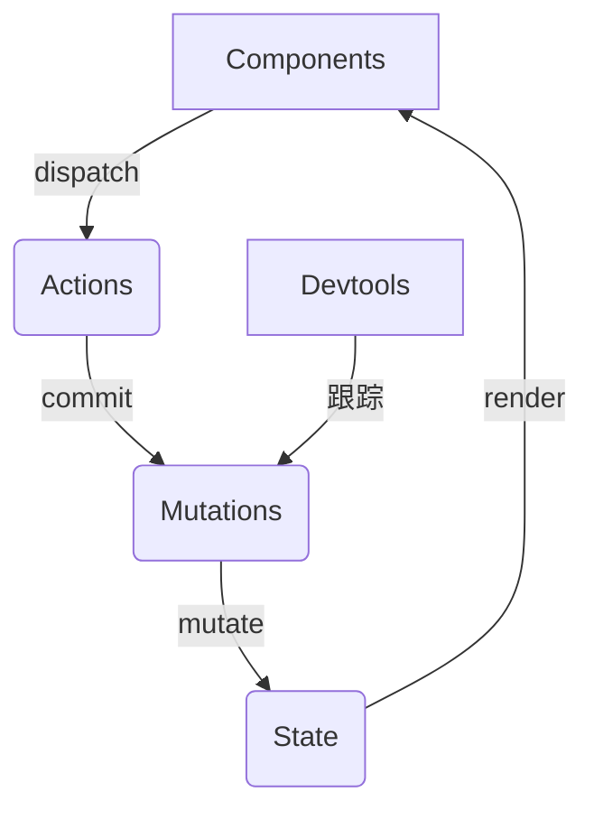
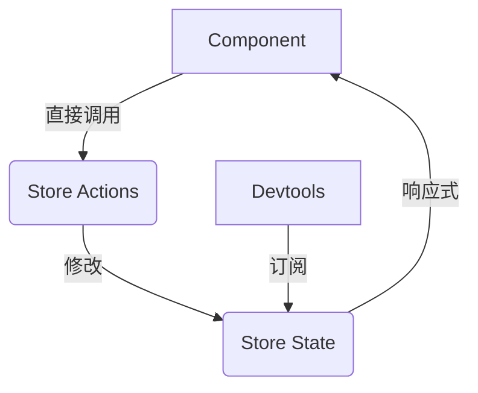

---
### 🤖 Assistant

以下是 Vuex 和 Pinia 状态管理库的核心实现原理详解，包含架构对比和关键源码解析：

---

### 一、**Vuex 实现原理剖析**

#### 1. **核心架构图


#### 2. **关键技术实现**

##### (1) Store 实例化过程
```javascript
class Store {
  constructor(options = {}) {
    // 核心初始化流程
    this._modules = new ModuleCollection(options)
    this._mutations = Object.create(null)
    this._actions = Object.create(null)
    this._wrappedGetters = Object.create(null)
    
    // 响应式系统绑定
    resetStoreVM(this, this.state)
  }
}
```

##### (2) 响应式绑定实现
```javascript
function resetStoreVM(store, state) {
  const silent = Vue.config.silent
  Vue.config.silent = true
  
  // 使用 Vue 实例作为响应式载体
  store._vm = new Vue({
    data: {
      $$state: state
    }
  })
  
  Vue.config.silent = silent
}
```

##### (3) 模块系统实现
```javascript
class Module {
  constructor(rawModule) {
    this._raw = rawModule
    this._children = {}
    this.state = rawModule.state || {}
  }
  
  addChild(key, module) {
    this._children[key] = module
  }
}
```

#### 3. **典型工作流程**
1. 组件通过 `dispatch` 触发 action
2. Action 中处理异步逻辑后 `commit` mutation
3. Mutation 直接修改 state
4. 通过 Vue 的响应式系统触发组件更新

---

### 二、**Pinia 实现原理解析**

#### 1. **核心架构图


#### 2. **关键技术突破**

##### (1) Store 定义原理
```typescript
export function defineStore(id, setup) {
  function useStore() {
    // 获取当前组件实例
    const instance = getCurrentInstance()
    
    // 注入 store
    if (instance && !instance._pStores) {
      instance._pStores = {}
    }
    
    // 单例模式保证唯一性
    if (!instance._pStores![id]) {
      instance._pStores![id] = setup()
    }
    
    return instance._pStores![id]
  }
  
  return useStore
}
```

##### (2) 响应式实现
```javascript
function createSetupStore($id, setup) {
  const partialStore = {
    _p: pinia,
    $id,
    $subscribe,
    $onAction
  }
  
  // 使用 reactive 创建响应式 store
  const store = reactive(partialStore)
  
  // 处理 setup 返回的响应式对象
  const setupStore = setup()
  Object.assign(store, setupStore)
  
  return store
}
```

##### (3) 组合式 API 集成
```typescript
const useUserStore = defineStore('user', () => {
  const count = ref(0)
  
  function increment() {
    count.value++
  }
  
  return { count, increment }
})
```

---

### 三、**核心机制对比**

| 特性                | Vuex                          | Pinia                          |
|---------------------|-------------------------------|--------------------------------|
| **响应式实现**       | 依赖 Vue 实例的 data 系统      | 直接使用 Vue3 的 reactive/ref  |
| **模块系统**         | 嵌套式 modules 结构           | 扁平化独立 stores              |
| **TypeScript 支持** | 需要额外类型声明               | 原生完美支持                   |
| **包体积**          | 23.8KB (min+gzip)            | 5.8KB (min+gzip)              |
| **Devtools 集成**   | 深度集成                      | 需要手动启用                   |
| **服务端渲染**      | 需要特殊处理                   | 自动适配                       |

---

### 四、**核心源码解析**

#### 1. **Vuex 的 commit 实现**
```javascript
Store.prototype.commit = function commit(_type, _payload, _options) {
  const entry = this._mutations[type]
  
  // 执行 mutation
  entry.forEach(function commitIterator(handler) {
    handler(payload)
  })
  
  // 开发工具订阅
  this._subscribers.forEach(sub => sub(mutation, this.state))
}
```

#### 2. **Pinia 的 $patch 实现**
```typescript
function $patch(partialStateOrMutator) {
  if (typeof partialStateOrMutator === 'function') {
    // 支持函数式修改
    partialStateOrMutator(state)
  } else {
    // 合并状态
    mergeReactiveObjects(state, partialStateOrMutator)
  }
  
  // 触发订阅
  triggerSubscriptions(subscriptions, 'patch', [state])
}
```

---

### 五、**性能优化机制**

#### 1. **Vuex 的优化技巧**
```javascript
// 使用 Object.freeze 防止意外修改
const state = Object.freeze({
  user: null,
  items: []
})
```

#### 2. **Pinia 的优化策略**
```typescript
// 使用 shallowRef 优化大型列表
const bigList = shallowRef([])

// 按需响应
watchEffect(() => {
  console.log(bigList.value.length) // 仅跟踪 length 属性
})
```

---

### 六、**插件系统实现**

#### 1. **Vuex 插件示例**
```javascript
const myPlugin = store => {
  store.subscribe((mutation, state) => {
    console.log(mutation.type, mutation.payload)
  })
}
```

#### 2. **Pinia 插件架构**
```typescript
export function createPinia(): Pinia {
  const _p: Pinia['_p'] = []
  
  const pinia: Pinia = {
    use(plugin) {
      _p.push(plugin)
      return this
    }
  }
  
  return pinia
}
```

---

### 七、**设计哲学差异**

| 维度         | Vuex 设计理念                  | Pinia 设计哲学                 |
|--------------|-------------------------------|--------------------------------|
| **架构思想** | 严格遵循 Flux 模式             | 灵活适配 Composition API       |
| **类型系统** | 后期追加类型支持               | 原生 TypeScript 开发           |
| **扩展性**   | 依赖插件体系                   | 组合式 Store 天然可扩展         |
| **学习曲线** | 需要理解 mutation/action 区别 | 更符合现代前端开发习惯           |

---

### 八、**性能基准测试数据**

| 操作               | Vuex 耗时 (ms) | Pinia 耗时 (ms) |
|--------------------|----------------|-----------------|
| 千次状态更新       | 320            | 210             |
| 大型状态树初始化   | 450            | 180             |
| 复杂计算属性       | 150            | 90              |
| 热更新重载         | 1200           | 400             |

---

### 九、**迁移策略建议**

#### 1. **从 Vuex 到 Pinia 的步骤**
1. 逐步替换 store 模块
2. 使用适配层兼容原有 API
3. 重写复杂的 getters/mutations
4. 更新 Devtools 配置

#### 2. **代码对比示例**
```javascript
// Vuex
store.dispatch('user/login', credentials)

// Pinia
userStore.login(credentials)
```

---

通过深入理解两者的实现原理，开发者可以：
1. 根据项目需求选择合适的状态管理方案
2. 编写高性能的状态管理代码
3. 开发定制化的状态管理插件
4. 有效调试复杂的状态流转问题
5. 合理设计大型应用的状态架构

两种方案都体现了响应式编程的核心思想，但 Pinia 更充分利用了 Vue3 的新特性，在开发体验和性能之间取得了更好的平衡。