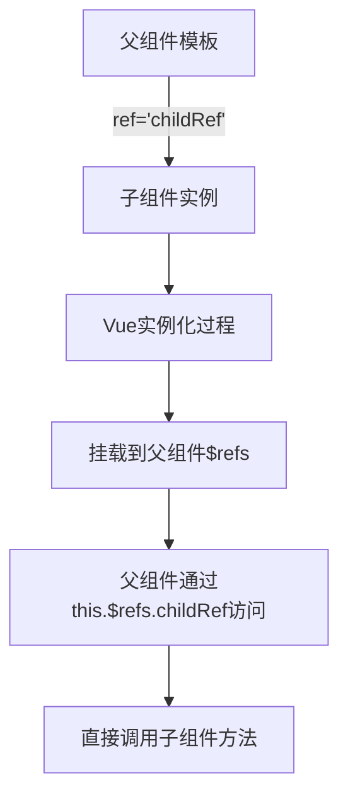
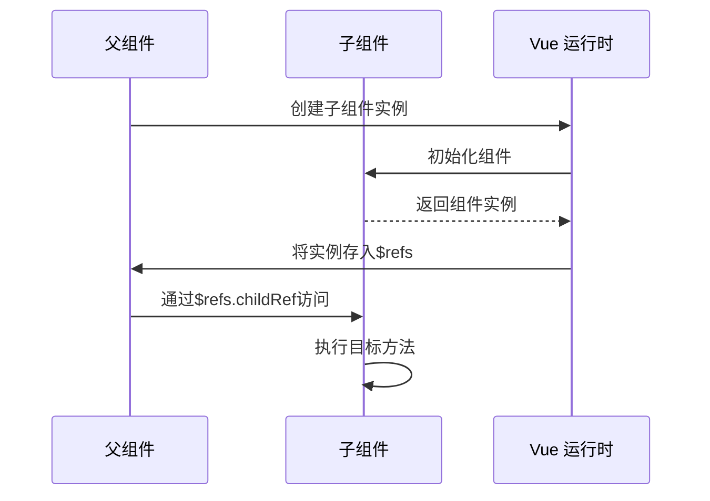
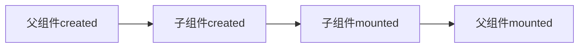

---
### 🤖 Assistant

在 Vue 中实现父组件调用子组件方法的原理，核心在于 **组件实例引用** 和 **JavaScript 对象引用机制**。下面通过三层架构原理图解和关键技术解析，帮你彻底理解这个过程的底层逻辑：

---

### 一、核心原理架构图


---

### 二、关键技术解析

#### 1. **组件实例化机制**
- **创建阶段**：当父组件渲染时，遇到子组件标签会触发：
  ```javascript
  // 伪代码演示实例化过程
  const childComponentInstance = new VueComponent(options)
  ```
- **挂载阶段**：子组件实例会被附加到父组件的渲染上下文中

#### 2. **ref 属性工作原理
```vue
<!-- 父组件模板 -->
<child ref="childRef"></child>

<!-- 编译后的渲染函数 -->
function render() {
  return createElement('child', {
    ref: 'childRef' // 关键标记
  })
}
```

Vue 在 patch 过程中会执行：
```javascript
// 伪代码：处理 ref 的核心逻辑
function registerRef(ref, vm) {
  if (ref in vm.$refs) {
    vm.$refs[ref] = getComponentInstance() // 获取子组件实例
  }
}
```

#### 3. **原型链访问机制**
```javascript
// 子组件类继承关系
ChildComponent.prototype = Object.create(Vue.prototype)

// 当父组件调用时：
this.$refs.childRef.childMethod() 

// 实际执行路径：
实例对象 → ChildComponent 方法 → Vue 原型方法
```

---

### 三、底层实现流程图解


---

### 四、关键技术点拆解

#### 1. **实例引用传递**
- 每个 Vue 组件都是独立的 Vue 实例
- 父组件通过 `$refs` 持有子组件实例的 **强引用**
- 内存关系示意图：
  ```
  [父组件实例]
    │
    ├── $refs
    │    └── childRef: [子组件实例]
    │          ├── _uid: 123
    │          ├── childMethod: ƒ()
    │          └── __proto__: Vue.prototype
    └── ...
  ```

#### 2. **响应式更新保障
当子组件方法修改数据时：
```javascript
this.childMethod = function() {
  this.dataValue = 'new' // 触发响应式更新
}
```
父组件的调用仍能保持数据同步，因为操作的是同一个响应式系统

#### 3. **生命周期时序控制

- **安全调用时机**：必须在父组件 `mounted` 之后才能可靠访问 `$refs`
- **异步保障**：推荐使用 `$nextTick`
  ```javascript
  mounted() {
    this.$nextTick(() => {
      this.$refs.childRef.method()
    })
  }
  ```

---

### 五、与传统OOP的对比

| 维度          | Vue 组件方法调用            | 经典OOP方法调用          |
|---------------|----------------------------|-------------------------|
| **实例获取**  | 通过 ref/DOM 查询           | 直接持有对象引用         |
| **访问控制**  | 默认公开所有方法            | 通过 public/private 控制 |
| **内存管理**  | Vue 自动回收                | 手动GC管理              |
| **继承关系**  | 原型链继承 Vue 功能         | 类继承体系              |

---

### 六、潜在风险与规避方案

#### 1. **引用失效问题**
**场景**：动态组件切换时旧引用残留  
**解决方案**：
```javascript
watch: {
  currentComponent() {
    this.$nextTick(() => {
      this.$refs.dynamicRef = null // 主动释放旧引用
    })
  }
}
```

#### 2. **方法冲突问题**
**场景**：子组件方法名与 Vue 内置方法重名  
**最佳实践**：
```javascript
// 子组件
methods: {
  // 使用命名空间前缀
  myComponentSubmit() { /* ... */ }
}
```

#### 3. **SSR 兼容问题**
**服务端渲染限制**：
```javascript
mounted() {
  // 客户端独有逻辑
  if (process.client) {
    this.$refs.child.method()
  }
}
```

---

### 七、扩展：Vue 3 Composition API 的变化

```typescript
// 父组件模板
<child ref="childRef"></child>

// 组合式API访问
import { ref } from 'vue'

export default {
  setup() {
    const childRef = ref<InstanceType<typeof ChildComponent>>()

    const callChild = () => {
      childRef.value?.exposedMethod() // 需要子组件显式暴露
    }

    return { childRef, callChild }
  }
}
```

**Vue 3 的重要改进**：
1. 使用 `defineExpose` 显式暴露方法
2. 更严格的类型检查
3. Ref 值通过 `.value` 访问

---

通过理解这些底层机制，开发者可以：
1. 更安全地设计组件通信方案
2. 避免常见的引用失效问题
3. 优化组件间的交互性能
4. 在复杂场景下快速定位问题根源

这种基于原型继承和实例引用的设计，体现了 Vue 在易用性与灵活性之间的平衡哲学。