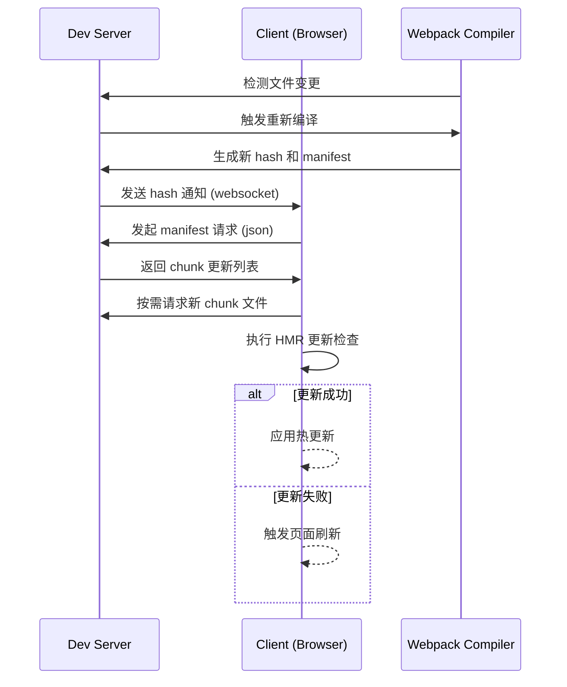

### 一、Webpack 动态加载（Code Splitting）原理

#### 核心流程（以 `import()` 为例）：

源码中的 import('./module') -> Webpack 编译阶段 -> 识别动态导入语法 -> 识别动态导入语法 -> 注入运行时逻辑 -> 浏览器执行时按需加载

#### 关键技术实现：
1. **代码分割策略**：
```javascript
   // 原始代码
   button.addEventListener('click', () => {
     import('./module.js').then(module => {
       module.doSomething()
     })
   })

   // 编译后生成：
   __webpack_require__.e(/* import() | module */ "src_module_js")
     .then(__webpack_require__.bind(__webpack_require__, "./src/module.js"))
     .then(module => { ... })
```

2. **JSONP 加载机制**：
```javascript
   // 动态加载的 chunk 文件内容：
   (window["webpackJsonp"] = window["webpackJsonp"] || []).push([
     ["chunkName"],
     {
       "./src/module.js": (function(...){...})
     }
   ]);
```

3. **运行时管理**：
   - 维护 `installedChunks` 记录加载状态
   - 使用 `Promise` 链管理异步流程
   - 通过 `__webpack_require__.e` 实现加载控制

#### 关键数据结构：
```javascript
// Webpack 运行时维护的模块状态
__webpack_require__ = {
  m: modules,        // 所有模块
  c: installedModules, // 缓存
  e: function(chunkId){...}, // 动态加载入口
  u: function(chunkId){...}, // 获取 chunk 路径
  l: function(url){...},     // 加载脚本
  ...
}
```

### 二、热更新（HMR）原理

#### 完整工作流程：


#### 核心模块交互：
1. **服务端组件**：
   - `webpack-dev-server`：创建 WebSocket 连接
   - `webpack.HotModuleReplacementPlugin`：生成 HMR 运行时代码

2. **客户端运行时**：
   ```javascript
   // 自动注入的 HMR 客户端代码
   if(module.hot) {
     module.hot.accept('./module', () => {
       // 更新逻辑
       renderComponent(require('./module').default)
     })
   }
   ```

#### 热更新关键步骤：
1. **文件变更检测**：
   ```javascript
   // webpack-dev-server 使用的 chokidar 库
   compiler.watch({
     aggregateTimeout: 300,
     poll: undefined
   }, (err, stats) => { ... })
   ```

2. **增量构建**：
   - 基于内存文件系统的快速编译
   - 生成包含 `hot-update.json` 和 `hot-update.js` 的补丁文件

3. **更新协议传输**：
   ```json
   // hot-update.json 示例
   {
     "h": "a1b2c3d4e5", // 新 hash 值
     "c": {"main": true} // 需要更新的 chunk
   }
   ```

4. **模块热替换**：
   ```javascript
   // HMR 核心检查逻辑
   function checkForUpdates() {
     // 1. 获取更新模块列表
     // 2. 执行 module.hot.check
     // 3. 应用 accept 处理程序
     // 4. 处理 dispose 清理
   }
   ```

#### 框架级 HMR 实现差异：
| 框架          | HMR 实现方式                        | 典型配置      |
| ----------- | ------------------------------- | --------- |
| React       | 使用 react-refresh-webpack-plugin | 保留组件状态更新  |
| Vue         | vue-loader 内置 HMR 支持            | 组件实例复用    |
| CSS Modules | style-loader 自动处理               | 直接替换样式表   |
| 普通 JS       | 需要手动编写 module.hot.accept 逻辑     | 重新执行初始化代码 |

### 三、性能优化关键指标对比

| 特性          | 动态加载                          | 热更新                          |
|---------------|----------------------------------|---------------------------------|
| 触发时机      | 运行时用户交互                   | 开发时文件保存                  |
| 网络影响      | 增加 HTTP 请求                   | 仅传输变更部分                  |
| 内存消耗      | 按需加载减少内存占用              | 需要维护新旧模块对比            |
| 典型使用场景  | 路由级分割/功能模块延迟加载       | 开发环境快速迭代                |
| 实现复杂度    | 中（需处理异步逻辑）              | 高（需全链路支持）              |
| 对业务影响    | 需要代码结构调整                 | 需要兼容 HMR API                |

### 四、深度优化技巧

#### 动态加载优化：
1. **预加载策略**：
   ```javascript
   // 使用魔法注释优化加载优先级
   import(/* webpackPreload: true */ 'ChartingLibrary')
   ```

2. **分组加载**：
   ```javascript
   // 配置 splitChunks 优化
   optimization: {
     splitChunks: {
       cacheGroups: {
         vendors: {
           test: /[\\/]node_modules[\\/]/,
           chunks: 'all'
         }
       }
     }
   }
   ```

#### 热更新优化：
1. **增量构建加速**：
   ```javascript
   // webpack.config.js
   module.exports = {
     cache: {
       type: 'filesystem',
       buildDependencies: {
         config: [__filename]
       }
     }
   }
   ```

2. **安全边界处理**：
   ```javascript
   if (module.hot) {
     module.hot.accept('./api', () => {
       // 重新初始化 API 连接
       initializeAPI()
     })
     module.hot.dispose(() => {
       // 清理旧资源
       cleanupOldResources()
     })
   }
   ```

### 五、典型问题解决方案

**动态加载常见问题**：
1. **Chunk 加载失败**：
   ```javascript
   // 添加错误处理回调
   import('./module')
     .then(...)
     .catch(error => {
       showErrorToast('模块加载失败')
     })
   ```

2. **加载性能优化**：
   ```nginx
   # 配置 HTTP/2 服务器推送
   location /static/ {
     http2_push /static/chunk-vendors.js;
   }
   ```

**热更新疑难解答**：
1. **状态丢失问题**：
   ```javascript
   // 在模块中保存重要状态
   if (module.hot) {
     module.hot.data = module.hot.data || {}
   }
   ```

2. **循环更新检测**：
   ```javascript
   // 配置最大重试次数
   module.hot.addStatusHandler(status => {
     if (status === 'fail') {
       window.location.reload()
     }
   })
   ```

通过理解这两个核心机制，开发者可以：
1. 实现更精细化的代码加载策略
2. 构建高性能的前端应用架构
3. 提升开发体验和生产效率
4. 快速定位构建和运行时问题