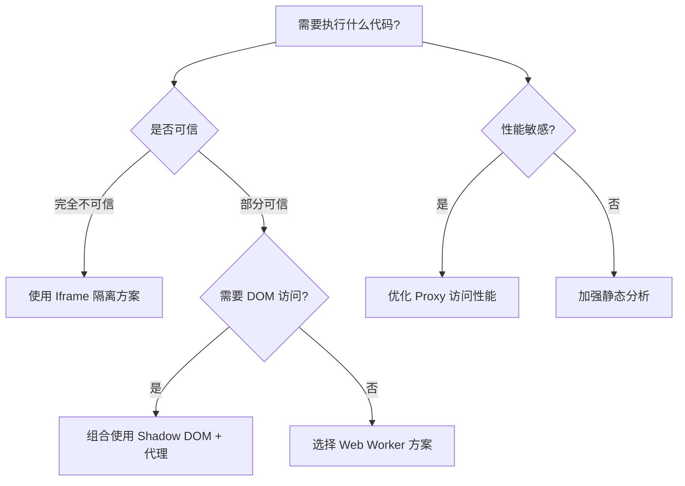

---
### 🤖 Assistant

---

设计一个安全的 JavaScript 沙盒环境需要综合考虑执行隔离、作用域控制、权限管理等多个层面。以下是分步骤的实现方案和关键技术选型：

---

### 一、沙盒核心设计原则
| 原则                | 实现目标                          | 典型风险                          |
|---------------------|-----------------------------------|----------------------------------|
| **代码隔离**         | 防止访问全局作用域                | 通过原型链污染全局对象           |
| **资源限制**         | 控制网络/存储/API 访问            | 恶意代码发起 DDOS 攻击           |
| **性能防护**         | 防止无限循环/内存泄漏             | 死循环导致浏览器崩溃             |
| **安全沙箱**         | 阻止危险操作（如 `eval`）         | XSS 攻击或隐私数据泄露           |

---

### 二、基础沙盒实现方案

#### 方案 1：作用域隔离 + Proxy 代理
```javascript
class Sandbox {
  constructor(context) {
    // 创建沙盒作用域
    const sandbox = Object.create(null);
    
    // 代理白名单
    const proxy = new Proxy(sandbox, {
      has(target, key) {
        return true; // 欺骗 in 操作符
      },
      get(target, key, receiver) {
        // 优先使用沙盒上下文
        if (key in context) return context[key];
        // 阻止访问全局对象
        if (key in globalThis) return undefined; 
        return Reflect.get(target, key, receiver);
      }
    });

    return proxy;
  }

  run(code) {
    const fn = new Function('sandbox', `with(sandbox){ ${code} }`);
    return fn(this.proxy);
  }
}

// 使用示例
const sandbox = new Sandbox({
  console,
  safeEval: (code) => {/* 安全评估逻辑 */}
});
sandbox.run('console.log("Hello from sandbox")');
```

#### 方案 2：Iframe 沙箱
```html
<iframe sandbox="allow-scripts" src="about:blank"></iframe>
<script>
  function createIframeSandbox() {
    const iframe = document.createElement('iframe');
    iframe.sandbox = 'allow-scripts';
    iframe.style.display = 'none';
    document.body.appendChild(iframe);
    return iframe.contentWindow;
  }

  const iframeWindow = createIframeSandbox();
  const script = iframeWindow.document.createElement('script');
  script.textContent = 'alert("安全代码执行")';
  iframeWindow.document.body.appendChild(script);
</script>
```

---

### 三、高级沙盒技术对比
| 技术方案               | 优点                              | 缺点                              | 适用场景              |
|------------------------|-----------------------------------|-----------------------------------|----------------------|
| **Proxy + with**       | 灵活控制访问，轻量级              | 无法完全隔离原型链，兼容性问题    | 简单插件系统          |
| **Iframe 隔离**        | 浏览器级安全隔离                  | 通信成本高，资源消耗大            | 高风险代码执行        |
| **Web Worker**         | 线程级隔离，不阻塞主线程          | 无法访问 DOM，功能受限            | 计算密集型任务        |
| **ShadowRealm API**    | 原生隔离支持，ECMAScript 标准提案  | 浏览器支持有限（Stage 3）         | 未来标准化方案        |

---

### 四、增强型沙盒实现（含安全防护）

#### 1. 代码静态分析
```javascript
// 使用 AST 分析危险模式
const acorn = require('acorn');
const walk = require('acorn-walk');

function validateCode(code) {
  const ast = acorn.parse(code, { ecmaVersion: 2022 });
  let isSafe = true;

  walk.simple(ast, {
    MemberExpression(node) {
      if (node.object.name === 'globalThis') {
        isSafe = false;
      }
    },
    CallExpression(node) {
      if (node.callee.name === 'eval') {
        isSafe = false;
      }
    }
  });

  return isSafe;
}
```

#### 2. 执行时间限制
```javascript
function runWithTimeout(code, timeout = 1000) {
  return new Promise((resolve, reject) => {
    const worker = new Worker(URL.createObjectURL(
      new Blob([`
        self.onmessage = () => {
          try {
            const result = eval(${JSON.stringify(code)});
            self.postMessage({ status: 'success', result });
          } catch (e) {
            self.postMessage({ status: 'error', error: e.message });
          }
        }
      `])
    ));

    const timer = setTimeout(() => {
      worker.terminate();
      reject(new Error('执行超时'));
    }, timeout);

    worker.onmessage = (e) => {
      clearTimeout(timer);
      resolve(e.data);
    };

    worker.postMessage('start');
  });
}
```

---

### 五、沙盒安全防护策略

#### 1. 权限分级控制
```javascript
const PERMISSION_LEVELS = {
  UNTRUSTED: {
    allowAPIs: ['console.log'],
    maxMemory: 10_000_000,
    maxExecutionTime: 500
  },
  TRUSTED: {
    allowAPIs: ['fetch', 'localStorage'],
    maxMemory: 100_000_000,
    maxExecutionTime: 5000
  }
};
```

#### 2. 资源访问监控
```javascript
class ResourceMonitor {
  constructor() {
    this.usage = {
      memory: 0,
      network: 0,
      storage: 0
    };
  }

  createProxy(api) {
    return new Proxy(api, {
      get: (target, prop) => {
        if (prop === 'fetch') {
          return (...args) => {
            this.usage.network++;
            return target[prop](...args);
          };
        }
        return target[prop];
      }
    });
  }
}
```

---

### 六、现代浏览器沙盒方案

#### 使用 Trusted Types API（防 DOM XSS）
```html
<!-- 启用强制策略 -->
<meta http-equiv="Content-Security-Policy" 
      content="require-trusted-types-for 'script'">
<script>
  if (window.trustedTypes) {
    const policy = trustedTypes.createPolicy('sandboxPolicy', {
      createHTML: (input) => {
        // 清理 HTML 输入
        return sanitizeHTML(input);
      }
    });
  }
</script>
```

---

### 七、沙盒设计决策树


---

### 八、最佳实践建议

1. **分层防御体系**：
   - 代码静态分析 → 运行时监控 → 环境隔离
2. **沙盒逃逸防护**：
   ```javascript
   // 防止通过构造函数访问全局
   const safeFunction = function(...args) {
     if (new.target) {
       throw new Error('禁止使用 new 操作符');
     }
     return Function(...args);
   };
   ```
3. **沙盒生命周期管理**：
   ```javascript
   class SandboxSession {
     constructor() {
       this.handles = new FinalizationRegistry(() => {
         // 自动清理资源
         this.cleanup();
       });
     }

     createContext() {
       const context = {/* ... */};
       this.handles.register(context, '清理标记');
       return context;
     }
   }
   ```

---

通过组合使用这些技术方案，可以根据具体场景（代码可信度、性能需求、浏览器兼容性）构建不同安全等级的沙盒环境。关键是在安全性和可用性之间找到平衡点，同时保持对新型攻击手段的持续防护能力。