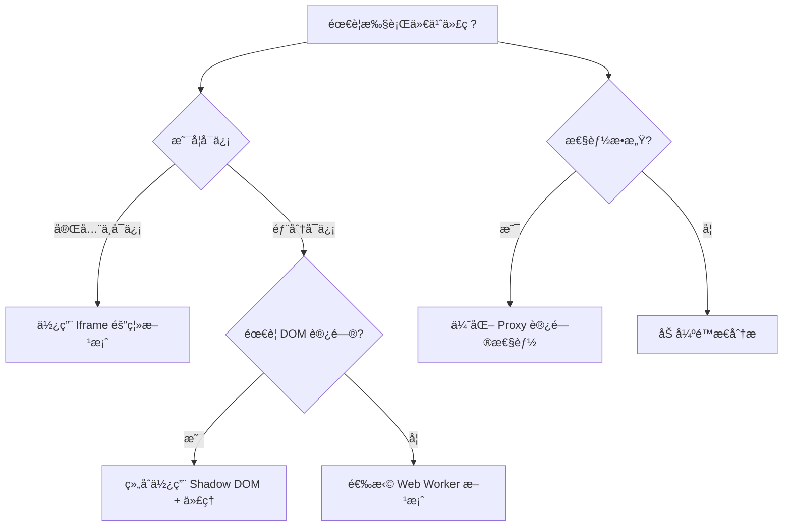

---
### 🤖 Assistant

---

设计一个安全的 JavaScript 沙盒ç¯å¢ƒéœ€è¦ç»¼åˆè€ƒè™‘执行隔离ã€ä½œç”¨åŸŸæ§åˆ¶ã€æƒé™ç®¡ç†ç­‰å¤šä¸ªå±‚é¢ã€‚以下是分步骤的å®ç°æ–¹æ¡ˆå’Œå…³é”®æŠ€æœ¯é€‰å‹ï¼š

---

### 一ã€æ²™ç›’核心设计åŸåˆ™
| åŸåˆ™                | å®ç°ç›®æ ‡                          | å…¸å‹é£é™©                          |
|---------------------|-----------------------------------|----------------------------------|
| **代ç éš”离**         | 防止访问全局作用域                | 通过åŸå‹é“¾æ±¡æŸ“全局对象           |
| **资æºé™åˆ¶**         | æ§åˆ¶ç½‘络/存储/API 访问            | æ¶æ„代ç å‘èµ· DDOS 攻击           |
| **性能防护**         | 防止无é™å¾ªç¯/å†…å­˜æ³„æ¼             | 死循ç¯å¯¼è‡´æµè§ˆå™¨å´©æºƒ             |
| **安全沙箱**         | 阻止å±é™©æ“作（如 `eval`）         | XSS 攻击或éšç§æ•°æ®æ³„露           |

---

### 二ã€åŸºç¡€æ²™ç›’å®ç°æ–¹æ¡ˆ

#### 方案 1：作用域隔离 + Proxy 代ç†
```javascript
class Sandbox {
  constructor(context) {
    // 创建沙盒作用域
    const sandbox = Object.create(null);
    
    // 代ç†ç™½åå•
    const proxy = new Proxy(sandbox, {
      has(target, key) {
        return true; // 欺骗 in æ“作符
      },
      get(target, key, receiver) {
        // 优先使用沙盒上下文
        if (key in context) return context[key];
        // 阻止访问全局对象
        if (key in globalThis) return undefined; 
        return Reflect.get(target, key, receiver);
      }
    });

    return proxy;
  }

  run(code) {
    const fn = new Function('sandbox', `with(sandbox){ ${code} }`);
    return fn(this.proxy);
  }
}

// 使用示例
const sandbox = new Sandbox({
  console,
  safeEval: (code) => {/* 安全评估逻辑 */}
});
sandbox.run('console.log("Hello from sandbox")');
```

#### 方案 2：Iframe 沙箱
```html
<iframe sandbox="allow-scripts" src="about:blank"></iframe>
<script>
  function createIframeSandbox() {
    const iframe = document.createElement('iframe');
    iframe.sandbox = 'allow-scripts';
    iframe.style.display = 'none';
    document.body.appendChild(iframe);
    return iframe.contentWindow;
  }

  const iframeWindow = createIframeSandbox();
  const script = iframeWindow.document.createElement('script');
  script.textContent = 'alert("安全代ç æ‰§è¡Œ")';
  iframeWindow.document.body.appendChild(script);
</script>
```

---

### 三ã€é«˜çº§æ²™ç›’技术对比
| 技术方案               | 优点                              | 缺点                              | 适用场景              |
|------------------------|-----------------------------------|-----------------------------------|----------------------|
| **Proxy + with**       | çµæ´»æ§åˆ¶è®¿é—®ï¼Œè½»é‡çº§              | 无法完全隔离åŸå‹é“¾ï¼Œå…¼å®¹æ€§é—®é¢˜    | 简å•æ’件系统          |
| **Iframe 隔离**        | æµè§ˆå™¨çº§å®‰å…¨éš”离                  | 通信æˆæœ¬é«˜ï¼Œèµ„æºæ¶ˆè€—大            | 高é£é™©ä»£ç æ‰§è¡Œ        |
| **Web Worker**         | 线程级隔离，ä¸é˜»å¡ä¸»çº¿ç¨‹          | 无法访问 DOM，功能å—é™            | 计算密集å‹ä»»åŠ¡        |
| **ShadowRealm API**    | åŸç”Ÿéš”离支æŒï¼ŒECMAScript 标准æ案  | æµè§ˆå™¨æ”¯æŒæœ‰é™ï¼ˆStage 3）         | 未æ¥æ ‡å‡†åŒ–方案        |

---

### å››ã€å¢å¼ºå‹æ²™ç›’å®ç°ï¼ˆå«å®‰å…¨é˜²æŠ¤ï¼‰

#### 1. 代ç é™æ€åˆ†æ
```javascript
// 使用 AST 分æå±é™©æ¨¡å¼
const acorn = require('acorn');
const walk = require('acorn-walk');

function validateCode(code) {
  const ast = acorn.parse(code, { ecmaVersion: 2022 });
  let isSafe = true;

  walk.simple(ast, {
    MemberExpression(node) {
      if (node.object.name === 'globalThis') {
        isSafe = false;
      }
    },
    CallExpression(node) {
      if (node.callee.name === 'eval') {
        isSafe = false;
      }
    }
  });

  return isSafe;
}
```

#### 2. 执行时间é™åˆ¶
```javascript
function runWithTimeout(code, timeout = 1000) {
  return new Promise((resolve, reject) => {
    const worker = new Worker(URL.createObjectURL(
      new Blob([`
        self.onmessage = () => {
          try {
            const result = eval(${JSON.stringify(code)});
            self.postMessage({ status: 'success', result });
          } catch (e) {
            self.postMessage({ status: 'error', error: e.message });
          }
        }
      `])
    ));

    const timer = setTimeout(() => {
      worker.terminate();
      reject(new Error('执行超时'));
    }, timeout);

    worker.onmessage = (e) => {
      clearTimeout(timer);
      resolve(e.data);
    };

    worker.postMessage('start');
  });
}
```

---

### 五ã€æ²™ç›’安全防护策略

#### 1. æƒé™åˆ†çº§æ§åˆ¶
```javascript
const PERMISSION_LEVELS = {
  UNTRUSTED: {
    allowAPIs: ['console.log'],
    maxMemory: 10_000_000,
    maxExecutionTime: 500
  },
  TRUSTED: {
    allowAPIs: ['fetch', 'localStorage'],
    maxMemory: 100_000_000,
    maxExecutionTime: 5000
  }
};
```

#### 2. 资æºè®¿é—®ç›‘æ§
```javascript
class ResourceMonitor {
  constructor() {
    this.usage = {
      memory: 0,
      network: 0,
      storage: 0
    };
  }

  createProxy(api) {
    return new Proxy(api, {
      get: (target, prop) => {
        if (prop === 'fetch') {
          return (...args) => {
            this.usage.network++;
            return target[prop](...args);
          };
        }
        return target[prop];
      }
    });
  }
}
```

---

### å…­ã€ç°ä»£æµè§ˆå™¨æ²™ç›’方案

#### 使用 Trusted Types API（防 DOM XSS）
```html
<!-- å¯ç”¨å¼ºåˆ¶ç­–ç•¥ -->
<meta http-equiv="Content-Security-Policy" 
      content="require-trusted-types-for 'script'">
<script>
  if (window.trustedTypes) {
    const policy = trustedTypes.createPolicy('sandboxPolicy', {
      createHTML: (input) => {
        // æ¸…ç† HTML 输入
        return sanitizeHTML(input);
      }
    });
  }
</script>
```

---

### 七ã€æ²™ç›’设计决策树


---

### å…«ã€æœ€ä½³å®è·µå»ºè®®

1. **分层防御体系**：
   - 代ç é™æ€åˆ†æ → è¿è¡Œæ—¶ç›‘æ§ â†’ ç¯å¢ƒéš”离
2. **沙盒逃逸防护**：
   ```javascript
   // 防止通过æ„造函数访问全局
   const safeFunction = function(...args) {
     if (new.target) {
       throw new Error('ç¦æ­¢ä½¿ç”¨ new æ“作符');
     }
     return Function(...args);
   };
   ```
3. **沙盒生命周期管ç†**：
   ```javascript
   class SandboxSession {
     constructor() {
       this.handles = new FinalizationRegistry(() => {
         // 自动清ç†èµ„æº
         this.cleanup();
       });
     }

     createContext() {
       const context = {/* ... */};
       this.handles.register(context, '清ç†æ ‡è®°');
       return context;
     }
   }
   ```

---

通过组åˆä½¿ç”¨è¿™äº›æŠ€æœ¯æ–¹æ¡ˆï¼Œå¯ä»¥æ ¹æ®å…·ä½“场景（代ç å¯ä¿¡åº¦ã€æ€§èƒ½éœ€æ±‚ã€æµè§ˆå™¨å…¼å®¹æ€§ï¼‰æ„建ä¸åŒå®‰å…¨ç­‰çº§çš„沙盒ç¯å¢ƒã€‚关键是在安全性和å¯ç”¨æ€§ä¹‹é—´æ‰¾åˆ°å¹³è¡¡ç‚¹ï¼ŒåŒæ—¶ä¿æŒå¯¹æ–°å‹æ”»å‡»æ‰‹æ®µçš„æŒç»­é˜²æŠ¤èƒ½åŠ›ã€‚