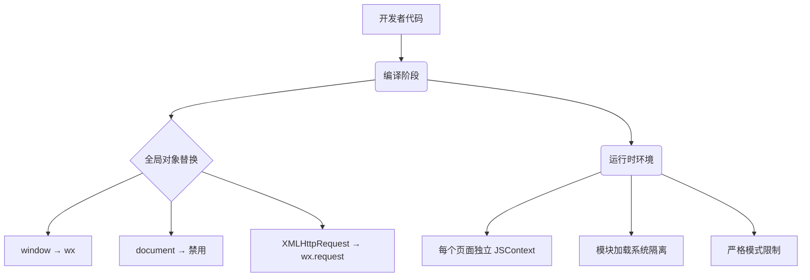
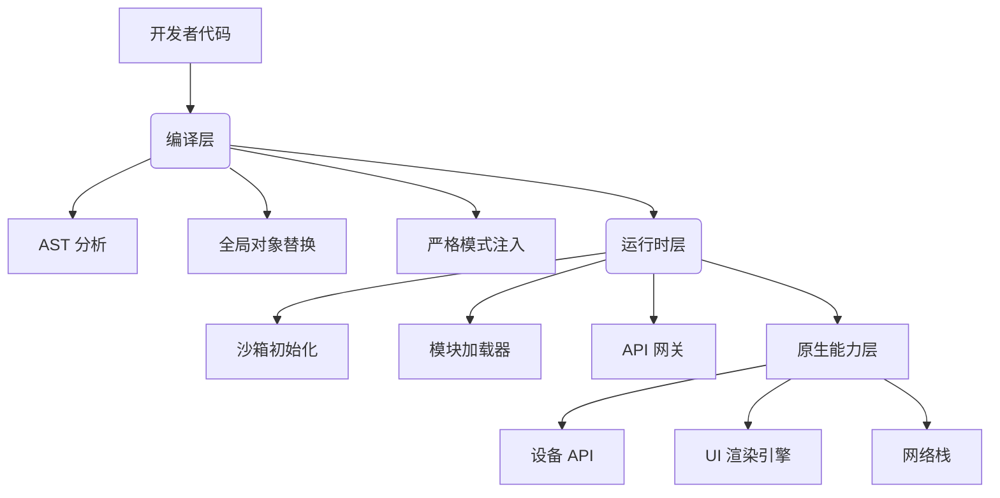
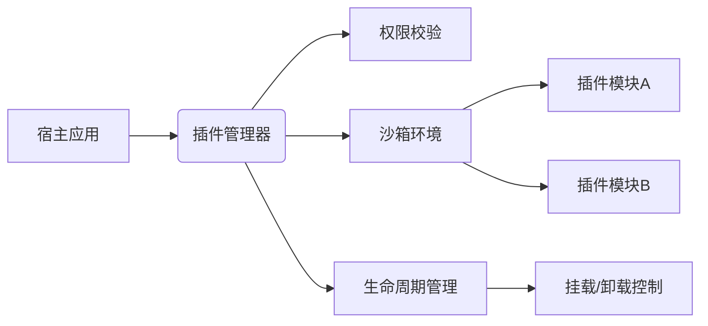

---
### 🤖 Assistant

---

### 小程序 API 的全局变量隐藏机制分析

#### 现有实现原理（以微信小程序为例）：


#### 核心防护手段：
1. **全局对象替换**：
   ```javascript
   // 原生环境访问被禁止
   console.log(window) // 输出 undefined
   console.log(document) // 报错

   // 替换后的访问方式
   wx.getSystemInfoSync() // 通过 API 访问系统信息
   ```

2. **模块作用域隔离**：
   ```javascript
   // 实际编译后的代码结构
   define('pages/index/index', (require, module, exports) => {
     const utils = require('../../utils/util.js')
     
     Page({
       data: {},
       onLoad() {
         // 模块内变量不会污染全局
         const privateVar = 'safe'
       }
     })
   })
   ```

3. **执行环境沙箱化**：
   ```javascript
   // 伪代码实现环境隔离
   function createSandbox() {
     const fakeWindow = Object.create(null)
     const context = {
       wx: wrapAPIs(wx),
       require: customRequire,
       module: { exports: {} },
       exports: {}
     }

     return vm.runInContext(`
       // 用户代码在此执行
       var globalVar = 'test'; 
       wx.navigateTo({url: '/page'})
     `, vm.createContext(context))
   }
   ```

---

### 自研小程序框架设计方案

#### 架构设计目标：
| 目标维度         | 实现方案                          |
|------------------|-----------------------------------|
| **变量隔离**     | 基于 Proxy 的动态作用域管控       |
| **API 安全**     | 分级权限管理系统                  |
| **模块通信**     | 消息通道 + 发布订阅模式           |
| **性能保障**     | 预编译 + 懒加载机制               |

#### 分层架构实现：


---

### 关键模块实现细节

#### 1. 沙箱环境构建
```javascript
class ScopeSandbox {
  constructor() {
    this.proxy = new Proxy(Object.create(null), {
      has: () => true, // 欺骗 with 语句
      get: (target, key) => {
        if (key in this.apiWhitelist) {
          return this.apiWhitelist[key]
        }
        return undefined // 阻止访问原生全局对象
      },
      set: () => false // 禁止设置全局变量
    })
  }

  execute(code) {
    const wrapper = `
      (function(proxy) {
        with(proxy) {
          ${code}
        }
      })
    `
    return new Function('proxy', wrapper)(this.proxy)
  }
}
```

#### 2. 模块通信系统
```javascript
// 跨页面通信协议设计
const eventBus = {
  _channels: new Map(),

  publish(event, data) {
    const channel = this._channels.get(event)
    channel?.forEach(cb => cb(data))
  },

  subscribe(event, callback) {
    if (!this._channels.has(event)) {
      this._channels.set(event, new Set())
    }
    this._channels.get(event).add(callback)
  }
}

// 页面间调用示例
eventBus.subscribe('dataUpdate', (payload) => {
  this.setData({ list: payload })
})
```

---

### 安全防护增强方案

#### 安全防护层级：
| 层级       | 防护措施                          | 实现示例                        |
|------------|-----------------------------------|---------------------------------|
| **编译时** | 静态代码分析                      | 检测危险模式 `eval` `with`      |
| **加载时** | 模块签名验证                      | RSA 校验模块完整性              |
| **运行时** | 行为监控 + 资源限制               | 内存使用阈值告警                |

#### 代码静态分析示例：
```javascript
const esprima = require('esprima')

function detectUnsafePattern(code) {
  const ast = esprima.parseScript(code)
  const unsafeNodes = []

  estraverse.traverse(ast, {
    enter(node) {
      if (node.type === 'CallExpression' && 
          node.callee.name === 'eval') {
        unsafeNodes.push(node)
      }
    }
  })

  return unsafeNodes
}
```

---

### 性能优化策略

#### 优化维度对比：
| 优化方向       | 传统 Web 方案                   | 小程序优化方案                  |
|----------------|---------------------------------|---------------------------------|
| **启动速度**   | HTTP 缓存 + CDN                 | 预加载分包 + 代码注入           |
| **渲染性能**   | Virtual DOM 优化                | 双线程通信优化 + 局部更新       |
| **内存管理**   | 垃圾回收机制                    | 页面实例回收 + 内存水位监控     |

#### 预加载机制实现：
```javascript
class Preloader {
  constructor() {
    this.resourceMap = new Map()
  }

  async preload(resources) {
    await Promise.all(resources.map(async res => {
      const content = await fetch(res.url)
      this.resourceMap.set(res.name, content)
    }))
  }

  getResource(name) {
    return this.resourceMap.get(name)
  }
}

// 使用示例
preloader.preload([
  { name: 'home', url: '/pages/home' },
  { name: 'vendor', url: '/static/vendor.js' }
])
```

---

### 框架扩展能力设计

#### 插件系统架构：


#### 插件安全通信示例：
```javascript
// 宿主与插件通信协议
class Bridge {
  constructor() {
    this.methods = {
      'hostToPlugin': new Set(),
      'pluginToHost': new Set()
    }
  }

  register(method, handler) {
    this.methods[method].add(handler)
  }

  postMessage(method, data) {
    if (!this.methods[method]) {
      throw new Error('非法通信方法')
    }
    this.methods[method].forEach(fn => fn(data))
  }
}

// 插件侧使用
bridge.register('pluginToHost', (data) => {
  console.log('收到宿主消息:', data)
})
```

---

通过以下设计原则实现全局变量的有效隐藏：
1. **环境重塑**：创建独立作用域链，替换原生全局对象
2. **沙箱隔离**：基于 Proxy 实现动态属性访问控制
3. **模块化规范**：强制使用 CommonJS 模块系统
4. **通信管控**：通过消息机制实现跨模块交互
5. **分层防护**：从编译到运行时的多阶段安全检查

此方案在保证开发者体验的同时，实现了类似小程序的全局变量隔离效果，且具备更强的可扩展性和安全性控制能力。